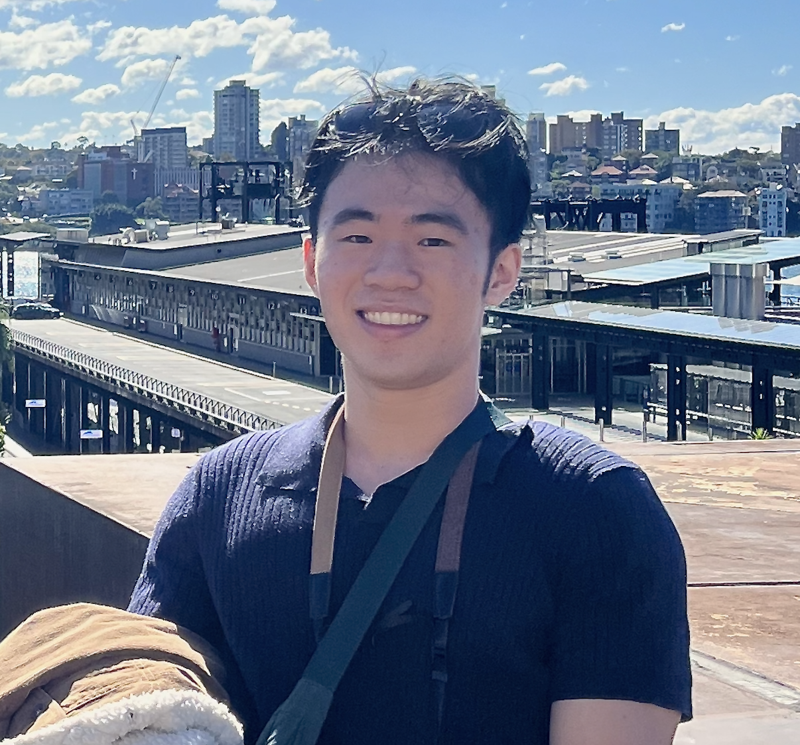
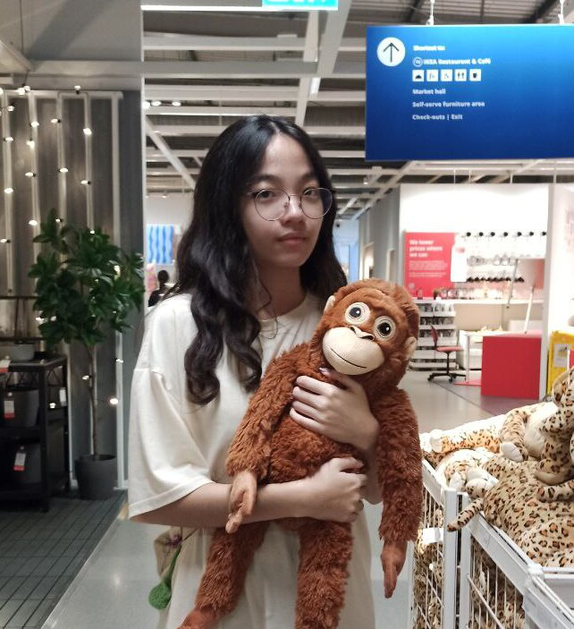
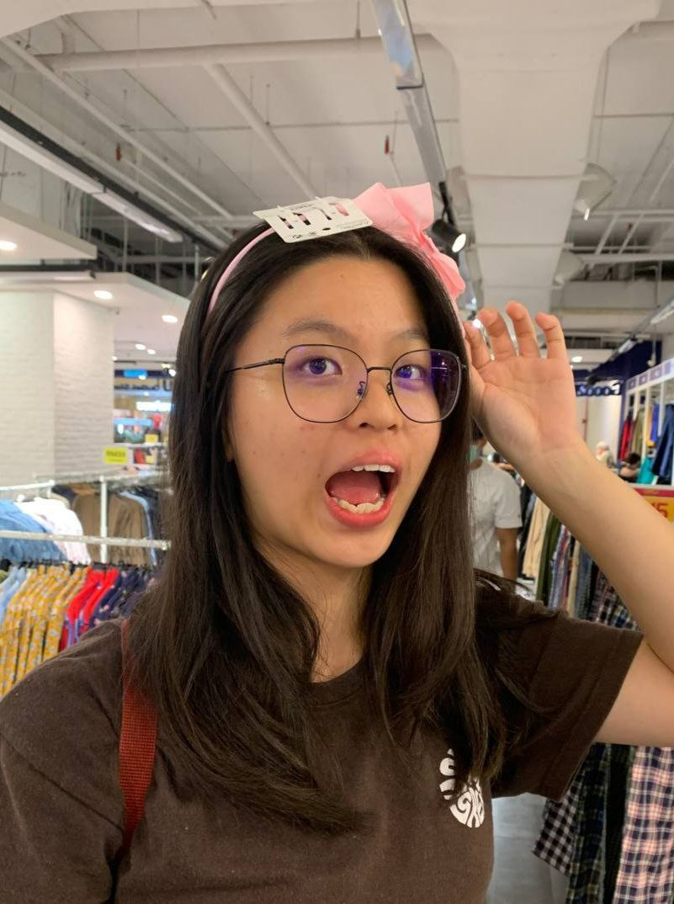

We are a team based in the [School of Computing, National University of Singapore](http://www.comp.nus.edu.sg).

You can reach us at the email `seer[at]comp.nus.edu.sg`

## Project team

### Loh Jian Rong

[[github](https://github.com/jianrong7)]
[[portfolio](team/jianrong7.md)]

* Role: Scheduling and Tracking, Integration
* Responsibilities: Logic, UI

### Nicole Ng

[[github](http://github.com/nicolengk)]
[[portfolio](team/nicolengk.md)]

* Role: Code Quality
* Responsibilities: UI, Logic

### Sara Ong

[[github](http://github.com/saraozn)] [[portfolio](team/saraozn.md)]

* Role: Deliverables and deadlines
* Responsibilities: Ensure project deliverables are done on time and in the right format.

### Jean Doe

[[github](http://github.com/johndoe)]
[[portfolio](team/johndoe.md)]

* Role: Developer
* Responsibilities: Dev Ops + Threading

### James Doe

[[github](http://github.com/johndoe)]
[[portfolio](team/johndoe.md)]

* Role: Developer
* Responsibilities: UI
