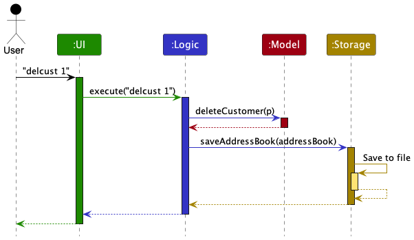
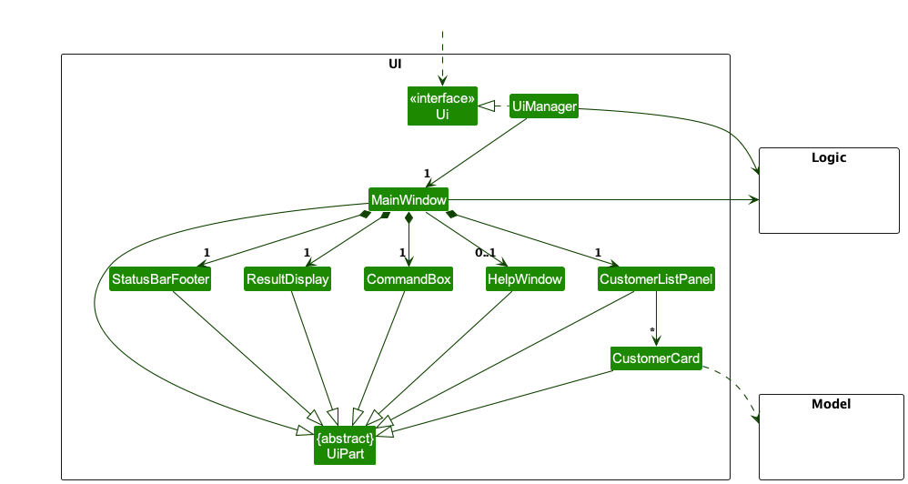
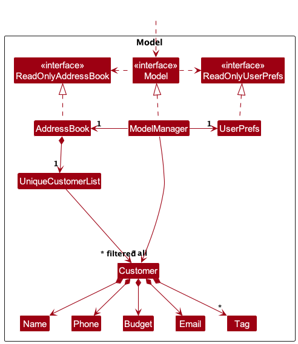
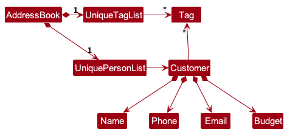
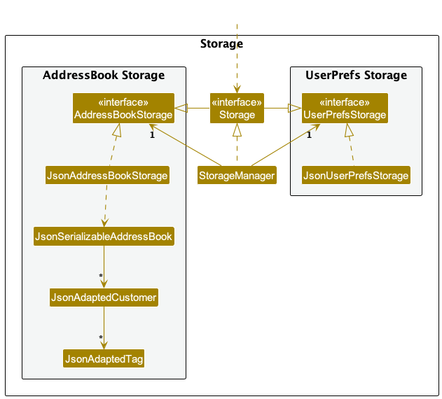

* Table of Contents
{:toc}

--------------------------------------------------------------------------------------------------------------------

## **Acknowledgements**

* {list here sources of all reused/adapted ideas, code, documentation, and third-party libraries -- include links to the original source as well}

--------------------------------------------------------------------------------------------------------------------

## **Setting up, getting started**

Refer to the guide [_Setting up and getting started_](SettingUp.md).

--------------------------------------------------------------------------------------------------------------------

## **Design**

:bulb: **Tip:** The `.puml` files used to create diagrams in this document `docs/diagrams` folder. Refer to the [_PlantUML Tutorial_ at se-edu/guides](https://se-education.org/guides/tutorials/plantUml.html) to learn how to create and edit diagrams.

### Architecture

The ***Architecture Diagram*** given above explains the high-level design of the App.

Given below is a quick overview of main components and how they interact with each other.

**Main components of the architecture**

**`Main`** (consisting of classes [`Main`](https://github.com/se-edu/addressbook-level3/tree/master/src/main/java/seedu/address/Main.java) and [`MainApp`](https://github.com/se-edu/addressbook-level3/tree/master/src/main/java/seedu/address/MainApp.java)) is in charge of the app launch and shut down.
* At app launch, it initializes the other components in the correct sequence, and connects them up with each other.
* At shut down, it shuts down the other components and invokes cleanup methods where necessary.

The bulk of the app's work is done by the following four components:

* [**`UI`**](#ui-component): The UI of the App.
* [**`Logic`**](#logic-component): The command executor.
* [**`Model`**](#model-component): Holds the data of the App in memory.
* [**`Storage`**](#storage-component): Reads data from, and writes data to, the hard disk.

[**`Commons`**](#common-classes) represents a collection of classes used by multiple other components.

**How the architecture components interact with each other**

The *Sequence Diagram* below shows how the components interact with each other for the scenario where the user issues the command `delete 1`.

Each of the four main components (also shown in the diagram above),

* defines its *API* in an `interface` with the same name as the Component.
* implements its functionality using a concrete `{Component Name}Manager` class (which follows the corresponding API `interface` mentioned in the previous point.

For example, the `Logic` component defines its API in the `Logic.java` interface and implements its functionality using the `LogicManager.java` class which follows the `Logic` interface. Other components interact with a given component through its interface rather than the concrete class (reason: to prevent outside component's being coupled to the implementation of a component), as illustrated in the (partial) class diagram below.

The sections below give more details of each component.

### UI component

The **API** of this component is specified in [`Ui.java`](https://github.com/se-edu/addressbook-level3/tree/master/src/main/java/seedu/address/ui/Ui.java)

The UI consists of a `MainWindow` that is made up of parts e.g.`CommandBox`, `ResultDisplay`, `PersonListPanel`, `StatusBarFooter` etc. All these, including the `MainWindow`, inherit from the abstract `UiPart` class which captures the commonalities between classes that represent parts of the visible GUI.

The `UI` component uses the JavaFx UI framework. The layout of these UI parts are defined in matching `.fxml` files that are in the `src/main/resources/view` folder. For example, the layout of the [`MainWindow`](https://github.com/se-edu/addressbook-level3/tree/master/src/main/java/seedu/address/ui/MainWindow.java) is specified in [`MainWindow.fxml`](https://github.com/se-edu/addressbook-level3/tree/master/src/main/resources/view/MainWindow.fxml)

The `UI` component,

* executes user commands using the `Logic` component.
* listens for changes to `Model` data so that the UI can be updated with the modified data.
* keeps a reference to the `Logic` component, because the `UI` relies on the `Logic` to execute commands.
* depends on some classes in the `Model` component, as it displays `Person` object residing in the `Model`.

### Logic component

**API** : [`Logic.java`](https://github.com/se-edu/addressbook-level3/tree/master/src/main/java/seedu/address/logic/Logic.java)

Here's a (partial) class diagram of the `Logic` component:

The sequence diagram below illustrates the interactions within the `Logic` component, taking `execute("delete 1")` API call as an example.

:information_source: **Note:** The lifeline for `DeleteCommandParser` should end at the destroy marker (X) but due to a limitation of PlantUML, the lifeline reaches the end of diagram.

How the `Logic` component works:

1. When `Logic` is called upon to execute a command, it is passed to an `AddressBookParser` object which in turn creates a parser that matches the command (e.g., `DeleteCommandParser`) and uses it to parse the command.
1. This results in a `Command` object (more precisely, an object of one of its subclasses e.g., `DeleteCommand`) which is executed by the `LogicManager`.
1. The command can communicate with the `Model` when it is executed (e.g. to delete a customer).
1. The result of the command execution is encapsulated as a `CommandResult` object which is returned back from `Logic`.

Here are the other classes in `Logic` (omitted from the class diagram above) that are used for parsing a user command:

How the parsing works:
* When called upon to parse a user command, the `AddressBookParser` class creates an `XYZCommandParser` (`XYZ` is a placeholder for the specific command name e.g., `AddCommandParser`) which uses the other classes shown above to parse the user command and create a `XYZCommand` object (e.g., `AddCommand`) which the `AddressBookParser` returns back as a `Command` object.
* All `XYZCommandParser` classes (e.g., `AddCommandParser`, `DeleteCommandParser`, ...) inherit from the `Parser` interface so that they can be treated similarly where possible e.g, during testing.

### Model component
**API** : [`Model.java`](https://github.com/se-edu/addressbook-level3/tree/master/src/main/java/seedu/address/model/Model.java)

The `Model` component,

* stores the address book data i.e., all `Person` objects (which are contained in a `UniquePersonList` object).
* stores the currently 'selected' `Person` objects (e.g., results of a search query) as a separate _filtered_ list which is exposed to outsiders as an unmodifiable `ObservableList<Person>` that can be 'observed' e.g. the UI can be bound to this list so that the UI automatically updates when the data in the list change.
* stores a `UserPref` object that represents the user’s preferences. This is exposed to the outside as a `ReadOnlyUserPref` objects.
* does not depend on any of the other three components (as the `Model` represents data entities of the domain, they should make sense on their own without depending on other components)

:information_source: **Note:** An alternative (arguably, a more OOP) model is given below. It has a `Tag` list in the `AddressBook`, which `Person` references. This allows `AddressBook` to only require one `Tag` object per unique tag, instead of each `Person` needing their own `Tag` objects. 

### Storage component

**API** : [`Storage.java`](https://github.com/se-edu/addressbook-level3/tree/master/src/main/java/seedu/address/storage/Storage.java)

The `Storage` component,
* can save both address book data and user preference data in JSON format, and read them back into corresponding objects.
* inherits from both `AddressBookStorage` and `UserPrefStorage`, which means it can be treated as either one (if only the functionality of only one is needed).
* depends on some classes in the `Model` component (because the `Storage` component's job is to save/retrieve objects that belong to the `Model`)

### Common classes

Classes used by multiple components are in the `seedu.addressbook.commons` package.

--------------------------------------------------------------------------------------------------------------------

## **Implementation**

This section describes some noteworthy details on how certain features are implemented.

### Deleting of customers and properties
[Back to top](#table-of-contents)

#### Motivation
The property agent may want to delete the profile of any customer or property that has been previously added into the app. For example, the property agent might want to remove a particular property after it has been sold.
Or, a particular client is no longer interested in buying a house anymore.

#### Implementation
The `DeleteCustomerCommand` and `DeletePropertyComannd` classes extends from the `Command` class. They are used to delete the details of a Customer or Property respectively. The command expects exactly one `INDEX` of the Customer or Property to be deleted, otherwise and error message will be displayed.
When the delete command is inputted, the `DeleteCustomerCommandParser` and `DeletePropertyCommandParser` classes are used to parse the user input and create the `DeleteCustomerCommand` and `DeletePropertyCommand` objects respectively.
When these created command objects are executed by the `LogicManager`, the `DeleteCustomerCommand#execute(Model model)` or `DeletePropertyCommand#execute(Model model)` methods are called. These methods will delete the customer or property in the model, and return a `CommandResult` object.

The following sequence diagram shows how the `DeleteCustomerCommand` is executed.
**INSERT SEQUENCE DIAGRAM HERE**

#### Design Considerations
**Aspect: How the delete commands should relate to each other:**

* **Alternative 1 (current choice):** `DeleteCustomerCommand` and `DeletePropertyCommand` are separate, and both inherit from the `Command` class.
    * Pros:
        * Both the `Customer` and `Property` classes have different fields that are exclusive to each other.
        * This reduces complexity of the system, and unexpected behaviours.
        * The inheritance of the `Command` class allows us to keep to the Command design pattern, to easily add more types of edit commands in the future, without having to change the existing code.
    * Cons:
        * More boilerplate code for each of the classes, which increases the size of the codebase.
* **Alternative 2:** A single `DeleteCommand` class is used to edit both customer and property.
    * Cons:
        * Unnecessary complexity is introduced into the system.

### Finding of Customers and Properties
[Back to top](#table-of-contents)

#### Motivation
The property agent may want to find and access the details of a particular Customer or Property that has been previously added into the app. For example, the property agent may want to refresh their memory on a particular customer's budget. Or the property agent may want to check the details of a particular property. 

#### Implementation
The `FindCustomerCommand` and `FindPropertyCommand` classes extends the `Command` class. They are used to find the profiles of a customer or property, respectively.
Both commands allow the user to find any customer or property. The commands expect at least one substring to base the search on, otherwise an error message will be displayed.

When the find command is inputted, the `FindCustomerCommandParser` and `FindPropertyCommandParser` classes are used to parse the user input and create the respective `FindCustomerCommand` and `FindPropertyCommand` objects.
When these created command objects are executed by the `LogicManager`, the `FindCustomerCommand#execute(Model model)` or `FindPropertyCommand#execute(Model model)` methods are called. These methods will find the customer or property in the model, and return a `CommandResult` object.

The following sequence diagram shows how the `FindCustomerCommand` is executed.
**INSERT SEQUENCE DIAGRAM HERE**

#### Design Considerations
**Aspect: How the find commands should relate to each other:**

* **Alternative 1 (current choice):** `FindCustomerCommand` and `FindPropertyCommand` are separate, and both inherit from the `Command` class.
    * Pros:
        * Both the `Customer` and `Property` classes have different fields that are exclusive to each other.
        * This reduces complexity of the system, and unexpected behaviours.
        * The inheritance of the `Command` class allows us to keep to the Command design pattern, to easily add more types of edit commands in the future, without having to change the existing code.
    * Cons:
        * More boilerplate code for each of the classes, which increases the size of the codebase.
* **Alternative 2:** A single `FindCommand` class is used to find both customer and property.
    * Cons:
        * Unnecessary complexity is introduced into the system.
  
### \[Proposed\] Undo/redo feature

#### Proposed Implementation

The proposed undo/redo mechanism is facilitated by `VersionedAddressBook`. It extends `AddressBook` with an undo/redo history, stored internally as an `addressBookStateList` and `currentStatePointer`. Additionally, it implements the following operations:

* `VersionedAddressBook#commit()` — Saves the current address book state in its history.
* `VersionedAddressBook#undo()` — Restores the previous address book state from its history.
* `VersionedAddressBook#redo()` — Restores a previously undone address book state from its history.

These operations are exposed in the `Model` interface as `Model#commitAddressBook()`, `Model#undoAddressBook()` and `Model#redoAddressBook()` respectively.

Given below is an example usage scenario and how the undo/redo mechanism behaves at each step.

Step 1. The user launches the application for the first time. The `VersionedAddressBook` will be initialized with the initial address book state, and the `currentStatePointer` pointing to that single address book state.

Step 2. The user executes `delete 5` command to delete the 5th customer in the address book. The `delete` command calls `Model#commitAddressBook()`, causing the modified state of the address book after the `delete 5` command executes to be saved in the `addressBookStateList`, and the `currentStatePointer` is shifted to the newly inserted address book state.

Step 3. The user executes `add n/David …​` to add a new customer. The `add` command also calls `Model#commitAddressBook()`, causing another modified address book state to be saved into the `addressBookStateList`.

:information_source: **Note:** If a command fails its execution, it will not call `Model#commitAddressBook()`, so the address book state will not be saved into the `addressBookStateList`.

Step 4. The user now decides that adding the customer was a mistake, and decides to undo that action by executing the `undo` command. The `undo` command will call `Model#undoAddressBook()`, which will shift the `currentStatePointer` once to the left, pointing it to the previous address book state, and restores the address book to that state.

:information_source: **Note:** If the `currentStatePointer` is at index 0, pointing to the initial AddressBook state, then there are no previous AddressBook states to restore. The `undo` command uses `Model#canUndoAddressBook()` to check if this is the case. If so, it will return an error to the user rather
than attempting to perform the undo.

The following sequence diagram shows how the undo operation works:

:information_source: **Note:** The lifeline for `UndoCommand` should end at the destroy marker (X) but due to a limitation of PlantUML, the lifeline reaches the end of diagram.

The `redo` command does the opposite — it calls `Model#redoAddressBook()`, which shifts the `currentStatePointer` once to the right, pointing to the previously undone state, and restores the address book to that state.

:information_source: **Note:** If the `currentStatePointer` is at index `addressBookStateList.size() - 1`, pointing to the latest address book state, then there are no undone AddressBook states to restore. The `redo` command uses `Model#canRedoAddressBook()` to check if this is the case. If so, it will return an error to the user rather than attempting to perform the redo.

Step 5. The user then decides to execute the command `list`. Commands that do not modify the address book, such as `list`, will usually not call `Model#commitAddressBook()`, `Model#undoAddressBook()` or `Model#redoAddressBook()`. Thus, the `addressBookStateList` remains unchanged.

Step 6. The user executes `clear`, which calls `Model#commitAddressBook()`. Since the `currentStatePointer` is not pointing at the end of the `addressBookStateList`, all address book states after the `currentStatePointer` will be purged. Reason: It no longer makes sense to redo the `add n/David …​` command. This is the behavior that most modern desktop applications follow.

The following activity diagram summarizes what happens when a user executes a new command:

#### Design considerations:

**Aspect: How undo & redo executes:**

* **Alternative 1 (current choice):** Saves the entire address book.
  * Pros: Easy to implement.
  * Cons: May have performance issues in terms of memory usage.

* **Alternative 2:** Individual command knows how to undo/redo by
  itself.
  * Pros: Will use less memory (e.g. for `delete`, just save the customer being deleted).
  * Cons: We must ensure that the implementation of each individual command are correct.

_{more aspects and alternatives to be added}_

### \[Proposed\] Data archiving

_{Explain here how the data archiving feature will be implemented}_

--------------------------------------------------------------------------------------------------------------------

## **Documentation, logging, testing, configuration, dev-ops**

* [Documentation guide](Documentation.md)
* [Testing guide](Testing.md)
* [Logging guide](Logging.md)
* [Configuration guide](Configuration.md)
* [DevOps guide](DevOps.md)

--------------------------------------------------------------------------------------------------------------------

## **Appendix: Requirements**

### Product scope

**Target user profile**:

Customer-property management tool for property agents new to the real estate industry in Singapore

**Value proposition**:

2 entities:

1. Customer:
    * Create :
      * Can add the types of property customer is looking for
    * Read :
      * Can check the types of property customer is looking for
    * Update :
      * Can update the types of property customer is looking for
    * Delete :
      * Delete client profile
    * Find :
      * Match customer to property
2. Property
   * Create :
     * Can add features of the property available (big, high-storey)
   * Read :
     * Can check features of the property available (big, high-storey)
   * Update :
     * Can update features of the property available (big, high-storey)
   * Delete :
     * Can remove features of the property available (big, high-storey)
     * Can remove properties
   * Find :
     * Can find properties available based on name, features

### User stories

Priorities: High (must have) - `* * *`, Medium (nice to have) - `* *`, Low (unlikely to have) - `*`

| Priority | As a …​                                                | I want to …​                                        | So that I can…​                                                               |
|----------|--------------------------------------------------------|-----------------------------------------------------|-------------------------------------------------------------------------------|
| `* * *`  | user                                                   | add a new customer's profile                        | add new customer to the application                                           |
| `* * *`  | user                                                   | add a new property and the details of it            | add newly available property to the application                               |
| `* * *`  | user                                                   | see all customers                                   | access all my customers                                                       |
| `* * *`  | user                                                   | see all properties                                  | access all available properties                                               |
| `* * *`  | user                                                   | remove existing customers                           | remove customer who is either not interested anymore or has bought a property |
| `* * *`  | user                                                   | remove existing properties                          | remove property which is either already sold or not sold anymore              |
| `* *`    | user                                                   | update customers' details                           | ensure customers' information is up to date                                   |
| `* *`    | user                                                   | update properties' details                          | ensure properties' information is up to date                                  |
| `* *`    | user with a lot of customers                           | find customers based on customers' details          | access specific customers with the detail                                     |
| `* *`    | user with a lot of properties                          | find properties based on properties' details        | access specific properties with the detail                                    |
| `* *`    | user with a lot of customers                           | filter customers based on customers' details        | get a list of specific customers with the detail                              |
| `* *`    | user with a lot of properties                          | filter properties based on properties' details      | get a list of specific properties with the detail                             |
| `*`      | user                                                   | add notes to customers' profiles                    | streamline customer management profile                                        |
| `*`      | user                                                   | add notes to properties' profiles                   | streamline customer property profile                                          |
| `*`      | experienced user using the application with new device | import and export customers' data                   | transfer customers' data across devices                                       |
| `*`      | experienced user using the application with new device | import and export properties' data                  | transfer properties' data across devices                                      |
| `*`      | user                                                   | view both customers and properties at the same time | conveniently compare customers and properties at the same time                |

*{More to be added}*

### Use cases

**Use Case: UC01 - Add property**

System: PropertyMatch address book

Actor: Property Agent

1. Property agent fills in name, address, characteristics, number, price of property
2. Property agent adds property to address book

**Use Case: UC02 - Add customer**

System: PropertyMatch address book

Actor: Property Agent

1. Property agent fills in name, phone number, email, budget and desired characteristic
2. Property agent adds customer to address book

**Use Case: UC03 - Delete property**

System: PropertyMatch address book

Actor: Property Agent

1. Property agent identifies the property to be deleted and retrieves its index
2. Property agent inserts the index into the CLI
3. Property agent deletes the property details from the address book

**Use Case: UC04 - Delete customer**

System: PropertyMatch address book

Actor: Property Agent

1. Property agent identifies the customer to be deleted and retrieves its index
2. Property agent inserts the index into the CLI
3. Property agent deletes the customer details from the address book

**Use Case: UC05 - List all entities**

System: PropertyMatch address book

Actor: Property Agent

1. Property agent decides to list either properties or customers
2. Property agent inserts `listprop` or `listcust` in CLI
3. Property agent is able to view all entities

**Use Case: UC06 - Edit entities**

System: PropertyMatch address book

Actor: Property Agent

1. Property agent decides to edit either properties or customers
2. Property agent identifies the property or customer to be deleted and retrieves its index
3. Property agent edits entity’s respective fields
4. Property agent is able to edit the entities details in the address book

**Use Case: UC07 - Match properties to customers**

System: PropertyMatch address book

Actor: Property Agent

1. Property agent identifies the characteristics of properties that customers want
2. Property agent enters the characteristics of the properties into the CLI
3. Property agent views the properties that adheres to the conditions given

**Use Case: UC08 - Find specific entity**

System: PropertyMatch address book

Actor: Property Agent

1. Property agent identifies the specific entity he wants
2. Property agent enters the entity index he wants
3. Property agent views the entity

**Use Case: UC09 - Import and export data**

System: PropertyMatch address book

Actor: Property Agent

1. Property agent can import data from another application to the existing application
2. Property agent can export data from the application and save the data

### Non-Functional Requirements

1.  Should work on any _mainstream OS_ as long as it has Java `11` or above installed.
2.  Should be able to hold up to 1000 properties and clients without a noticeable sluggishness in performance for typical usage.
3.  A user with above average typing speed for regular English text (i.e. not code, not system admin commands) should be able to accomplish most of the tasks faster using commands than using the mouse.
4.  The system should respond within two seconds.
5.  The product is offered as a free application.
6.  The user interface should be intuitive enough for property agents who are not IT-savvy.
7.  Should work on any computer fewer than five years old.
8.  Should work without requiring an installer.
9.  Should not require access to an internet connection.
10. Should save data locally in a human editable file.
11. Should have a graphical user interface with readable font of at least size 11.
12. Should have a graphical user interface which is intuitive and user-friendly.
13. Should not require user to have any prior technical knowledge or expertise.

### Glossary

* **Mainstream OS**: Windows, Linux, Unix, OS-X

--------------------------------------------------------------------------------------------------------------------

## **Appendix: Instructions for manual testing**

Given below are instructions to test the app manually.

:information_source: **Note:** These instructions only provide a starting point for testers to work on;
testers are expected to do more *exploratory* testing.

### Launch and shutdown

1. Initial launch

   1. Download the jar file and copy into an empty folder

   1. Double-click the jar file Expected: Shows the GUI with a set of sample contacts. The window size may not be optimum.

1. Saving window preferences

   1. Resize the window to an optimum size. Move the window to a different location. Close the window.

   1. Re-launch the app by double-clicking the jar file. 
       Expected: The most recent window size and location is retained.

1. _{ more test cases …​ }_

### Deleting a customer

1. Deleting a customer while all customers are being shown

   1. Prerequisites: List all customers using the `list` command. Multiple customers in the list.

   1. Test case: `delete 1` 
      Expected: First contact is deleted from the list. Details of the deleted contact shown in the status message. Timestamp in the status bar is updated.

   1. Test case: `delete 0` 
      Expected: No customer is deleted. Error details shown in the status message. Status bar remains the same.

   1. Other incorrect delete commands to try: `delete`, `delete x`, `...` (where x is larger than the list size) 
      Expected: Similar to previous.

1. _{ more test cases …​ }_

### Saving data

1. Dealing with missing/corrupted data files

   1. _{explain how to simulate a missing/corrupted file, and the expected behavior}_

1. _{ more test cases …​ }_
