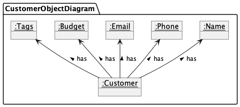
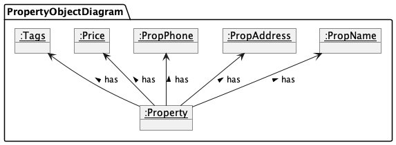
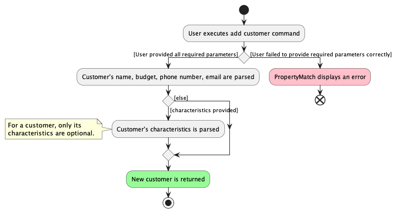
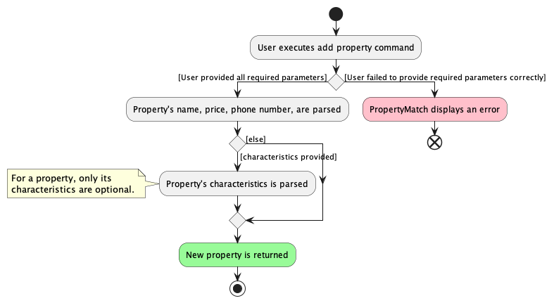
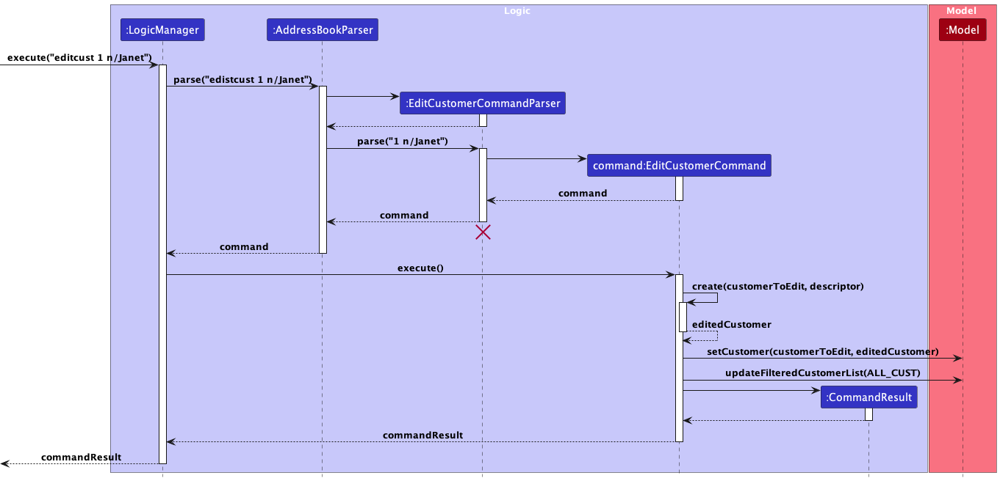
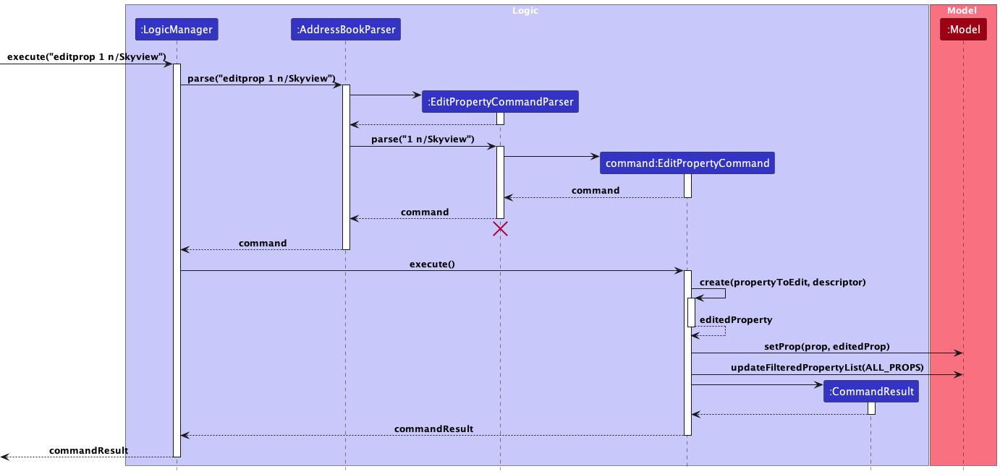
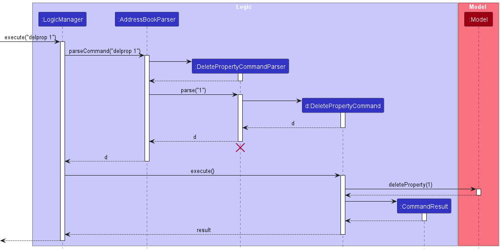
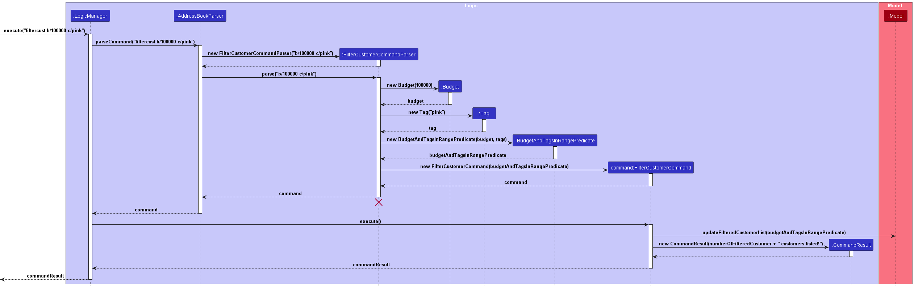
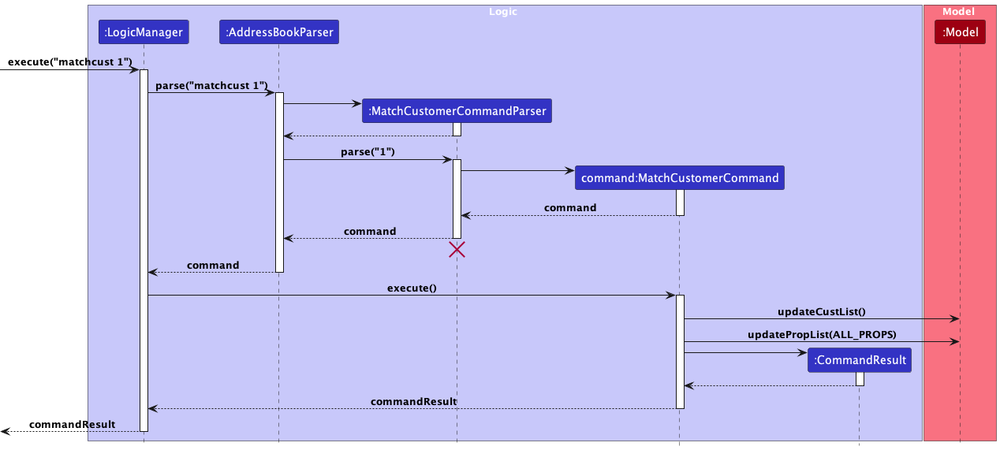

## Introduction

PropertyMatch is a JavaFX application that helps property agents manage their database of customers and properties using a command-line interface.

## Purpose of the Developer Guide

This guide was made for developers looking to comprehend or build upon the functionalities of PropertyMatch, and software testers looking to test PropertyMatch’s features.

## About the Guide

This developer guide provides a high-level architecture overview of the workings of PropertyMatch, followed by main features and functions of PropertyMatch along with their explanations, design considerations and implementations

## Table of Contents

* Table of Contents
 {:toc}

--------------------------------------------------------------------------------------------------------------------

## **1. Acknowledgements**

* Our developer guide is built upon [Addressbook-level3](https://se-education.org/addressbook-level3/DeveloperGuide.html)

--------------------------------------------------------------------------------------------------------------------

## **2. Setting up, getting started**

Refer to the guide [_Setting up and getting started_](SettingUp.md).

--------------------------------------------------------------------------------------------------------------------

## **3. Design**

<div markdown="span" class="alert alert-primary">

:bulb: **Tip:** The `.puml` files used to create diagrams in this document `docs/diagrams` folder. Refer to the [_PlantUML Tutorial_ at se-edu/guides](https://se-education.org/guides/tutorials/plantUml.html) to learn how to create and edit diagrams.
</div>

### 3.1 Architecture


The ***Architecture Diagram*** given above explains the high-level design of the App.

Given below is a quick overview of main components and how they interact with each other.

**Main components of the architecture**

**`Main`** (consisting of classes [`Main`](https://github.com/se-edu/addressbook-level3/tree/master/src/main/java/seedu/address/Main.java) and [`MainApp`](https://github.com/se-edu/addressbook-level3/tree/master/src/main/java/seedu/address/MainApp.java)) is in charge of the app launch and shut down.
* At app launch, it initializes the other components in the correct sequence, and connects them up with each other.
* At shut down, it shuts down the other components and invokes cleanup methods where necessary.

The bulk of the app's work is done by the following four components:

* [**`UI`**](#ui-component): The UI of the App.
* [**`Logic`**](#logic-component): The command executor.
* [**`Model`**](#model-component): Holds the data of the App in memory.
* [**`Storage`**](#storage-component): Reads data from, and writes data to, the hard disk.

[**`Commons`**](#common-classes) represents a collection of classes used by multiple other components.

**How the architecture components interact with each other**

The *Sequence Diagram* below shows how the components interact with each other for the scenario where the user issues the command `delete 1`.


Each of the four main components (also shown in the diagram above),

* defines its *API* in an `interface` with the same name as the Component.
* implements its functionality using a concrete `{Component Name}Manager` class (which follows the corresponding API `interface` mentioned in the previous point.

For example, the `Logic` component defines its API in the `Logic.java` interface and implements its functionality using the `LogicManager.java` class which follows the `Logic` interface. Other components interact with a given component through its interface rather than the concrete class (reason: to prevent outside component's being coupled to the implementation of a component), as illustrated in the (partial) class diagram below.


The sections below give more details of each component.

### 3.2 UI component

The **API** of this component is specified in [`Ui.java`](https://github.com/se-edu/addressbook-level3/tree/master/src/main/java/seedu/address/ui/Ui.java)


The UI consists of a `MainWindow` that is made up of parts e.g.`CommandBox`, `ResultDisplay`, `PersonListPanel`, `StatusBarFooter` etc. All these, including the `MainWindow`, inherit from the abstract `UiPart` class which captures the commonalities between classes that represent parts of the visible GUI.

The `UI` component uses the JavaFx UI framework. The layout of these UI parts are defined in matching `.fxml` files that are in the `src/main/resources/view` folder. For example, the layout of the [`MainWindow`](https://github.com/se-edu/addressbook-level3/tree/master/src/main/java/seedu/address/ui/MainWindow.java) is specified in [`MainWindow.fxml`](https://github.com/se-edu/addressbook-level3/tree/master/src/main/resources/view/MainWindow.fxml)

The `UI` component,

* executes user commands using the `Logic` component.
* listens for changes to `Model` data so that the UI can be updated with the modified data.
* keeps a reference to the `Logic` component, because the `UI` relies on the `Logic` to execute commands.
* depends on some classes in the `Model` component, as it displays `Person` object residing in the `Model`.

### 3.3 Logic component

**API** : [`Logic.java`](https://github.com/se-edu/addressbook-level3/tree/master/src/main/java/seedu/address/logic/Logic.java)

Here's a (partial) class diagram of the `Logic` component:


The sequence diagram below illustrates the interactions within the `Logic` component, taking `execute("delete 1")` API call as an example.


<div markdown="span" class="alert alert-info">:information_source: **Note:** The lifeline for `DeleteCommandParser` should end at the destroy marker (X) but due to a limitation of PlantUML, the lifeline reaches the end of diagram.
</div>

How the `Logic` component works:

1. When `Logic` is called upon to execute a command, it is passed to an `AddressBookParser` object which in turn creates a parser that matches the command (e.g., `DeleteCommandParser`) and uses it to parse the command.
1. This results in a `Command` object (more precisely, an object of one of its subclasses e.g., `DeleteCommand`) which is executed by the `LogicManager`.
1. The command can communicate with the `Model` when it is executed (e.g. to delete a customer).
1. The result of the command execution is encapsulated as a `CommandResult` object which is returned back from `Logic`.

Here are the other classes in `Logic` (omitted from the class diagram above) that are used for parsing a user command:


How the parsing works:
* When called upon to parse a user command, the `AddressBookParser` class creates an `XYZCommandParser` (`XYZ` is a placeholder for the specific command name e.g., `AddCommandParser`) which uses the other classes shown above to parse the user command and create a `XYZCommand` object (e.g., `AddCommand`) which the `AddressBookParser` returns back as a `Command` object.
* All `XYZCommandParser` classes (e.g., `AddCommandParser`, `DeleteCommandParser`, ...) inherit from the `Parser` interface so that they can be treated similarly where possible e.g, during testing.

### 3.4 Model component

**API** : [`Model.java`](https://github.com/se-edu/addressbook-level3/tree/master/src/main/java/seedu/address/model/Model.java)


The `Model` component,

* stores the address book data i.e., all `Person` objects (which are contained in a `UniquePersonList` object).
* stores the currently 'selected' `Person` objects (e.g., results of a search query) as a separate _filtered_ list which is exposed to outsiders as an unmodifiable `ObservableList<Person>` that can be 'observed' e.g. the UI can be bound to this list so that the UI automatically updates when the data in the list change.
* stores a `UserPref` object that represents the user’s preferences. This is exposed to the outside as a `ReadOnlyUserPref` objects.
* does not depend on any of the other three components (as the `Model` represents data entities of the domain, they should make sense on their own without depending on other components)

<div markdown="span" class="alert alert-info">:information_source: **Note:** An alternative (arguably, a more OOP) model is given below. It has a `Tag` list in the `AddressBook`, which `Person` references. This allows `AddressBook` to only require one `Tag` object per unique tag, instead of each `Person` needing their own `Tag` objects.<br>


</div>


### 3.5 Storage component

**API** : [`Storage.java`](https://github.com/se-edu/addressbook-level3/tree/master/src/main/java/seedu/address/storage/Storage.java)


The `Storage` component,
* can save both address book data and user preference data in JSON format, and read them back into corresponding objects.
* inherits from both `AddressBookStorage` and `UserPrefStorage`, which means it can be treated as either one (if only the functionality of only one is needed).
* depends on some classes in the `Model` component (because the `Storage` component's job is to save/retrieve objects that belong to the `Model`)

### 3.6 Common classes

Classes used by multiple components are in the `seedu.addressbook.commons` package.

--------------------------------------------------------------------------------------------------------------------

## 4. **Implementation**

This section describes some noteworthy details on how certain features are implemented.

### 4.1 Internal implementations of Customer and Property
[Back to top](#table-of-contents)

#### 4.1.1 Customer
The structure of a `Customer` object can be viewed in the object diagram below.



From the diagram, the `Customer` object consists of the following attributes.
- `Name`: The name of the customer.
- `Phone`: The phone number of the customer.
- `Email`: The email address of the customer.
- `Budget`: The budget that the customer is willing to pay for the property.
- `Tags`: The characteristics of the property that the customer is looking for.

#### 4.1.2 Property
The structure of a `Property` object can be viewed in the object diagram below.



From the diagram, the `Property` object consists of the following attributes.
- `PropName`: The name of the property.
- `PropAddress`: The address of the property.
- `PropPhone`: The phone number of the property.
- `Price`: The price of the property.
- `Tags`: The characteristics of the property that the customer is looking for.

#### 4.1.3 User input validation
Phone numbers both follow this validation regex.
```
public static final String VALIDATION_REGEX = "(6|8|9)\\d{7}";
```
This means that phone numbers must start with 6, 8, or 9 and must have at least 8 digits. This means it only supports Singapore phone numbers.

<br>

`Price` and `Budget` follow this validation regex.
```
public static final String VALIDATION_REGEX = "[1-9]\\d{4,11}";
```
This means that the price or budget must be a positive integer with at least 5 digits and at most 12 digits. It also cannot start with 0.

We decided on this arbitrary limit because we thought that it is not possible for a property to cost less than 10,000 dollars. We also thought that it is not possible for a property to cost more than 1 trillion dollars.

### 4.2 Adding of customers and properties
[Back to top](#table-of-contents)

#### 4.2.1 Customers
The customer list should not allow duplicate customers to be added. This is because it is not possible for a customer to have two profiles. This means we need to define a condition to check if the customer is already in the list.

At the start, we used a customer's `Name` to check if he was a duplicate entry. However, we realised that two unique customers may have the same names. Therefore, we decided to use the customer's `Phone` number to check if he was a duplicate entry. This is because it is unlikely for two unique customers to have the same phone number.

The activity diagram for the creation of a customer can be seen below.


#### 4.2.2 Properties
Similar to the customer list, the property list should not allow duplicate properties to be added as well. This is because it will cause bugs in our other features. This means we need to define a condition to check if the property is already in the list.

At the start, we used a property's `Name` to check if he was a duplicate entry. However, we realised that two unique properties may have the same names. Therefore, we decided to use the property's `Address` to check if he was a duplicate entry. This is because it is unlikely for two unique properties to have the same address.

The activity diagram for the creation of a property can be seen below.


### 4.1 Editing of buyers and properties
[Back to top](#table-of-contents)

#### 4.1.1 Motivation
The property agent may want to edit the details of a customer or property after adding it to the application. For example, the property agent may want to change the budget range of a customer after adding it to PropertyMatch.
Or, the property agent may want to change the budget of a property after adding it to PropertyMatch.

#### 4.1.2 Implementation
The `EditCustomerCommand` and `EditPropertyCommand` classes extends the `Command` class. They are used to edit the details of a customer or property, respectively.
Both commands allow the user to change any of the fields of a customer or property. The commands expect at least one flag to be edited, otherwise an error message will be displayed.
When the edit command is inputted, the `EditCustomerCommandParser` and `EditPropertyCommandParser` classes are used to parse the user input and create the respective `EditCustomerCommand` and `EditPropertyCommand` objects.
When these created command objects are executed by the `LogicManager`, the `EditCustomerCommand#execute(Model model)` or `EditPropertyCommand#execute(Model model)` methods are called. These methods will edit the customer or property in the model, and return a `CommandResult` object.

<div markdown="span" class="alert alert-primary">:exclamation: **Note:**
To be more concise, we will be referring to both customers and properties as entities in this section from here onwards.
</div>

During this execution process, the existing entity is first retrieved from the model. The fields of the entities are then edited according to what flags were passed in by the user during the edit commands.
A new customer or property is then created with the edited fields, and any fields that have not been edited will be copied over from the original entity. The new entity is then added to the model, and the original entity is removed from the model.
The new customer or property is then added into the model, replacing the old one. The new entity will then be displayed to the user, and a success message is displayed.

#### 4.1.3 Design Considerations
**Aspect: How the edit commands should relate to each other:**

* **Alternative 1 (current choice):** `EditCustomerCommand` and `EditPropertyCommand` are separate, and both inherit from the `Command` class.
    * Pros:
        * Both the `Customer` and `Property` classes have different fields that are exclusive to each other.
        * This reduces complexity of the system, and unexpected behaviours.
        * The inheritance of the `Command` class allows us to keep to the Command design pattern, to easily add more types of edit commands in the future, without having to change the existing code.
    * Cons:
        * More boilerplate code for each of the classes, which increases the size of the codebase.
* **Alternative 2:** A single `EditCommand` class is used to edit both customer and property.
    * Cons:
        * Unnecessary complexity is introduced into the system.

**Aspect: How the edited entities should interact with the model:**
* We also decided for the edit commands to create a new entity, instead of editing the existing one. This allows us to not include any setters in the `Customer` and `Property` classes, which make the objects immutable, so there is less likelihood of unexpected changes to the object. This enables us to maintain the defensiveness of our code.
  By creating a new entity every time the property agent edits, we can easily add the new customer or property into the model, and remove the old one. This also allows us to easily undo the edit command in the future, by simply adding the old entity back into the model.

The following sequence diagram shows how the `EditCustomerCommand` is executed.



The following sequence diagram shows how the `EditPropertyCommand` is executed.


### 4.2 Deleting of customers and properties
[Back to top](#table-of-contents)

#### 4.2.1 Motivation
The property agent may want to delete the profile of any customer or property that has been previously added into the app. For example, the property agent might want to remove a particular property after it has been sold.
Or, a particular client is no longer interested in buying a house anymore.

#### 4.2.2 Implementation
The `DeleteCustomerCommand` and `DeletePropertyComannd` classes extends from the `Command` class. They are used to delete the details of a Customer or Property respectively. The command expects exactly one `INDEX` of the Customer or Property to be deleted, otherwise an error message will be displayed.
When the delete command is inputted, the `DeleteCustomerCommandParser` and `DeletePropertyCommandParser` classes are used to parse the user input and create the `DeleteCustomerCommand` or `DeletePropertyCommand` objects respectively.

When these created command objects are executed by the `LogicManager`, the `DeleteCustomerCommand#execute(Model model)` or `DeletePropertyCommand#execute(Model model)` methods are called. These methods will delete the customer or property in the model, and return a `CommandResult` object.

#### 4.2.3Design Considerations
**Aspect: How the delete commands should relate to each other:**

* **Alternative 1 (current choice):** `DeleteCustomerCommand` and `DeletePropertyCommand` are separate, and both inherit from the `Command` class.


* **Alternative 2:** A single `DeleteCommand` class is used to edit both customer and property.
    * Cons:
        * Unnecessary complexity is introduced into the system.

The following sequence diagram shows how the `DeleteCustomerCommand` is executed.


The following sequence diagram shows how the `DeletePropertyCommand` is executed.


### 4.3 Finding of Customers and Properties
[Back to top](#table-of-contents)

#### 4.3.1 Motivation
The property agent may want to find and access the details of a particular Customer or Property that has been previously added into the app. For example, the property agent may want to refresh their memory on a particular customer's budget. Or the property agent may want to check the details of a particular property.

#### 4.3.2 Implementation
The `FindCustomerCommand` and `FindPropertyCommand` classes extends the `Command` class. They are used to find the profiles of a customer or property, respectively.
Both commands allow the user to find any customer or property. The commands expect at least one substring to base the search on, otherwise an error message will be displayed.

When the find command is inputted, the `FindCustomerCommandParser` and `FindPropertyCommandParser` classes are used to parse the user input and create the respective `FindCustomerCommand` and `FindPropertyCommand` objects.
When these created command objects are executed by the `LogicManager`, the `FindCustomerCommand#execute(Model model)` or `FindPropertyCommand#execute(Model model)` methods are called. These methods will find the customer or property in the model, and return a `CommandResult` object.

The following sequence diagram shows how the `FindCustomerCommand` is executed.


#### 4.3.3 Design Considerations
**Aspect: How the find commands should relate to each other:**

* **Alternative 1 (current choice):** `FindCustomerCommand` and `FindPropertyCommand` are separate, and both inherit from the `Command` class.
    * Pros:
        * Both the `Customer` and `Property` classes have different fields that are exclusive to each other.
        * This reduces complexity of the system, and unexpected behaviours.
        * The inheritance of the `Command` class allows us to keep to the Command design pattern, to easily add more types of edit commands in the future, without having to change the existing code.
    * Cons:
        * More boilerplate code for each of the classes, which increases the size of the codebase.
* **Alternative 2:** A single `FindCommand` class is used to find both customer and property.
    * Cons:
        * Unnecessary complexity is introduced into the system.

### 4.4 Filtering of Customers and Properties
[Back to top](#table-of-contents)

#### 4.4.1 Motivation
The property agent may want to see a list of customers based on their budget. For example, the property agent may want to filter customers with budget more than $100000.
Or, the property agent may want to see a list of customers based on the characteristics of the property they desired. For example, the property agent may want to filter customers who love pink properties.
Or, the property agent may want to see a list of customers based on both budget and characteristics to enhance productivity.

The property agent may also want to see a list of properties based on their budget. For example, the property agent may want to filter properties with budget less than $1000000.
Or, the property agent may want to see a list of properties based on the characteristics. For example, the property agent may want to filter pink properties.
Or, the property agent may want to see a list of properties based on both budget and characteristics to enhance productivity.

#### 4.4.2 Implementation
The `FilterCustomerCommand` and `FilterPropertyCommand` class extends the `Command` class. They are used to filter customers and properties, respectively.
The `filtercust` command allows the user to filter customers based on their budget and/or properties' characteristics they love. While the `filterprop` command allows the user to filter properties based on their budget and/or characteristics.
The commands expect at least one flag, either budget/price or characteristics, to be used as a filter.
When the filter command is inputted, the `FilterCustomerCommandParser` and `FilterPropertyCommandParser` class is used to parse the user input and create the respective `FilterCustomerCommand` or `FilterPropertyCommand` objects.
When these created command objects are executed by the `LogicManager`, the `FilterCustomerCommand#execute(Model model)` or `FilterCustomerCommand#execute(Model model)` methods are called. These methods will update the filtered customer or property list in the `model` which will eventually update the customers shown in the UI, and return a `CommandResult` object.

During this execution process, a new `BudgetAndTagsInRangePredicate` or `PriceAndTagsInRangePredicate` object which is used as a predicate to check whether a customer's budget is bigger and all the characteristics are desired by the customer or whether a property's price is lower and the property has all the characteristics, respectively.
All customers or properties will be tested using this `BudgetAndTagsInRangePredicate` or `PriceAndTagsInRangePredicate`. Customers or proeprties which satisfy this condition will be included into the `FilteredCustomerList` or `FilteredPropertyList` in the model.

The following sequence diagram shows how the `FilterCustomerCommand` is executed.


#### 4.4.3 Design Considerations
**Aspect: How the filter customer commands should relate to filter property commands:**

* **Alternative 1 (current choice):** `FilterCustomerCommand`  and `FilterPropertyCommand` inherit from the `Command` class and separated with each other.
    * Pros:
        * Both the `Customer` and `Property` classes have different fields that are exclusive to each other.
        * This reduces complexity of the system, and unexpected behaviours.
        * The inheritance of the `Command` class allows us to keep to the Command design pattern, to easily add more types of edit commands in the future, without having to change the existing code.
    * Cons:
        * More boilerplate code for each of the classes, which increases the size of the codebase.
* **Alternative 2:** A single `FilterCommand` class is used to edit both customer and property.
    * Cons:
        * Unnecessary complexity is introduced into the system.

**Aspect: How the filtered customers or properties should interact with the model:**
* We also decided for the filter commands to put the filtered customers or filtered properties in a different list (`FilteredCustomerList` and `FilteredPropertyList`), instead of removing the 'unused' customers and propertiesfrom the model.

### 4.5 Matching for Customers and Properties
[Back to top](#table-of-contents)

#### 4.5.1 Motivation
The property agent may want to get all properties that satisfy the customers criteria or get all customers that want the properties characteristics. For example, the property agent want to get all properties that certain specified customer want and can afford.
Or, the property agent want to get all customers that might want to buy certain specified property.

#### 4.5.2 Implementation
The `MatchCustomerCommand` and `MatchPropertyCommand` classes extends the `Command` class.
They are used to match the details of a customer or property, respectively.
The command expects exactly one "Index" of the customer or property to be match, otherwise an error message will be displayed.
When the match command is inputted, the `MatchCustomerCommandParser` or `MatchPropertyCommandParser` classes are used to parse the user input and create the `MatchCustomerCommand` or `MatchPropertyCommand` objects respectively.
When these created command objects are executed by the `LogicManager`, the `MatchCustomerCommand#execute(Model model)` or `MatchProeprtyCommand#execute(Model model)` method is called.
These methods will match the customer or property in the model, and return a `ComandResult` object.

The following sequence diagram shows how the `MatchCustomerCommand` is executed.


#### 4.5.3 Design Consideration

* *Alternative 1 (current choice):* `MatchPropertyCommand` and `MatchCustomerCommand` are separate, and both inherit from the `Command` class.
    * Pros:
        * Allows the property agent to match only customers or properties.
        * The inheritance of the `Command` class allows us to keep to the Command design pattern, to easily add more types of edit commands in the future, without having to change the existing code.
    * Cons:
        * More code for each of the classes, which increases the size of the codebase
        * More commands for the property agent to remember
* *Alternative 2:* A single `MatchCommand` class is used to match both customers and properties.
    * Pros:
        * Lesser commands for the property agent to remember
    * Cons:
        * Unable to match only customers or properties without specify it which increase the complexity of the commands

### 4.6 Reset the application with `Clear`
[Back to top](#table-of-contents)

#### 4.6.1 Motivation
The property agent may want to clear the list of customers or properties to start from a clean slate.

#### 4.6.2 Implementation
The `ClearCommand` extends the `Command` class. It is used to clear the list of customers or properties.

#### 4.6.3 Design Considerations

* **Alternative 1:** `ClearPropertyCommand` and `ClearCustomerCommand` are separate, and both inherit from the `Command` class.
    * Pros:
        * Allows the property agent to clear only customers or properties.
        * The inheritance of the `Command` class allows us to keep to the Command design pattern, to easily add more types of edit commands in the future, without having to change the existing code.
    * Cons:
        * More boilerplate code for each of the classes, which increases the size of the codebase
        * More commands for the property agent to remember
* **Alternative 2 (current choice):** A single `ClearCommand` class is used to clear both customers and properties.
    * Pros:
        * Less overhead to deal with
        * Lesser commands for the property agent to remember
    * Cons:
        * Unable to clear only customers or properties

### 4.7 Exit with a delay
[Back to top](#table-of-contents)

#### 4.7.1 Motivation
The property agent should exit the application with a peace of mind. A delay is required for the property agent to read the exit message before the application closes.

#### 4.7.2 Implementation
The `ExitCommand` extends the `Command` class. It is used to close the application and display the goodbye message.
The following code is used to implement the delay. There are many ways to implement a timeout, but since we are using JavaFX. This is probably the simplest way to accomplish it.
```
PauseTransition delay = new PauseTransition(Duration.seconds(3));
delay.setOnFinished(e -> primaryStage.hide());
delay.play();
```

--------------------------------------------------------------------------------------------------------------------

## **Documentation, logging, testing, configuration, dev-ops**

* [Documentation guide](Documentation.md)
* [Testing guide](Testing.md)
* [Logging guide](Logging.md)
* [Configuration guide](Configuration.md)
* [DevOps guide](DevOps.md)

--------------------------------------------------------------------------------------------------------------------

## **Appendix A: Requirements**

### A.1 Product scope

**Target user profile**:

Customer-property management tool for property agents new to the real estate industry in Singapore

**Value proposition**:

2 entities:

1. Customer:
    * Create :
      * Can add the types of property customer is looking for
    * Read :
      * Can check the types of property customer is looking for
    * Update :
      * Can update the types of property customer is looking for
    * Delete :
      * Delete client profile
    * Find :
      * Match customer to property
2. Property
   * Create :
     * Can add features of the property available (big, high-storey)
   * Read :
     * Can check features of the property available (big, high-storey)
   * Update :
     * Can update features of the property available (big, high-storey)
   * Delete :
     * Can remove features of the property available (big, high-storey)
     * Can remove properties
   * Find :
     * Can find properties available based on name, features


### A.2 User stories

Priorities: High (must have) - `* * *`, Medium (nice to have) - `* *`, Low (unlikely to have) - `*`

| Priority | As a …​                                                | I want to …​                                        | So that I can…​                                                               |
|----------|--------------------------------------------------------|-----------------------------------------------------|-------------------------------------------------------------------------------|
| `* * *`  | user                                                   | add a new customer's profile                        | add new customer to the application                                           |
| `* * *`  | user                                                   | add a new property and the details of it            | add newly available property to the application                               |
| `* * *`  | user                                                   | see all customers                                   | access all my customers                                                       |
| `* * *`  | user                                                   | see all properties                                  | access all available properties                                               |
| `* * *`  | user                                                   | remove existing customers                           | remove customer who is either not interested anymore or has bought a property |
| `* * *`  | user                                                   | remove existing properties                          | remove property which is either already sold or not sold anymore              |
| `* *`    | user                                                   | update customers' details                           | ensure customers' information is up to date                                   |
| `* *`    | user                                                   | update properties' details                          | ensure properties' information is up to date                                  |
| `* *`    | user with a lot of customers                           | find customers based on customers' details          | access specific customers with the detail                                     |
| `* *`    | user with a lot of properties                          | find properties based on properties' details        | access specific properties with the detail                                    |
| `* *`    | user with a lot of customers                           | filter customers based on customers' details        | get a list of specific customers with the detail                              |
| `* *`    | user with a lot of properties                          | filter properties based on properties' details      | get a list of specific properties with the detail                             |
| `* *`    | user with a lot of customers                           | get properties based on customers' details          | get a list of specific properties with the detail satisfy the customer        |
| `* *`    | user with a lot of properties                          | get customers based on properties' details          | get a list of specific customers with the detail satisfy the property         |
| `*`      | user                                                   | add notes to customers' profiles                    | streamline customer management profile                                        |
| `*`      | user                                                   | add notes to properties' profiles                   | streamline customer property profile                                          |
| `*`      | experienced user using the application with new device | import and export customers' data                   | transfer customers' data across devices                                       |
| `*`      | experienced user using the application with new device | import and export properties' data                  | transfer properties' data across devices                                      |
| `*`      | user                                                   | view both customers and properties at the same time | conveniently compare customers and properties at the same time                |

### A.3 Use cases

**Use Case: UC01 - Add property**

System: PropertyMatch address book

Actor: Property Agent

1. Property agent fills in name, address, characteristics (tags), number, budget of property
2. Property agent adds property to address book

**Use Case: UC02 - Add customer**

System: PropertyMatch address book

Actor: Property Agent

1. Property agent fills in name, phone number, email, budget and desired characteristic (tags)
2. Property agent adds customer to address book

**Use Case: UC03 - Delete property**

System: PropertyMatch address book

Actor: Property Agent

1. Property agent identifies the property to be deleted and retrieves its index
2. Property agent inserts the index into the CLI
3. Property agent deletes the property details from the address book

**Use Case: UC04 - Delete customer**

System: PropertyMatch address book

Actor: Property Agent

1. Property agent identifies the customer to be deleted and retrieves its index
2. Property agent inserts the index into the CLI
3. Property agent deletes the customer details from the address book

**Use Case: UC05 - List all entities**

System: PropertyMatch address book

Actor: Property Agent

1. Property agent decides to list either properties or customers
2. Property agent inserts `listprop` or `listcust` in CLI
3. Property agent is able to view all entities

**Use Case: UC06 - Edit entities**

System: PropertyMatch address book

Actor: Property Agent

1. Property agent decides to edit either properties or customers
2. Property agent identifies the property or customer to be deleted and retrieves its index
3. Property agent edits entity’s respective fields
4. Property agent is able to edit the entities details in the address book

**Use Case: UC07 - Match properties to customers**

System: PropertyMatch address book

Actor: Property Agent

1. Property agent identifies the characteristics of properties that customers want
2. Property agent enters the characteristics of the properties into the CLI
3. Property agent views the properties that adheres to the conditions given

**Use Case: UC08 - Match customers to properties**

System: PropertyMatch address book

Actor: Property Agent

1. Property agent identifies the characteristics the customers want that belong to properties
2. Property agent enters the characteristics of the customers into the CLI
3. Property agent views the customers that adheres to the conditions given

**Use Case: UC09 - Find specific entity**

System: PropertyMatch address book

Actor: Property Agent

1. Property agent identifies the specific entity he wants
2. Property agent enters the entity index he wants
3. Property agent views the entity

**Use Case: UC10 - Import and export data**

System: PropertyMatch address book

Actor: Property Agent

1. Property agent can import data from another application to the existing application
2. Property agent can export data from the application and save the data


### A.4 Non-Functional Requirements

1.  Should work on any _mainstream OS_ as long as it has Java `11` or above installed.
2.  Should be able to hold up to 1000 properties and clients without a noticeable sluggishness in performance for typical usage.
3.  A user with above average typing speed for regular English text (i.e. not code, not system admin commands) should be able to accomplish most of the tasks faster using commands than using the mouse.
4.  The system should respond within two seconds.
5.  The product is offered as a free application.
6.  The user interface should be intuitive enough for property agents who are not IT-savvy.
7.  Should work on any computer fewer than five years old.
8.  Should work without requiring an installer.
9.  Should not require access to an internet connection.
10. Should save data locally in a human editable file.
11. Should have a graphical user interface with readable font of at least size 11.
12. Should have a graphical user interface which is intuitive and user-friendly.
13. Should not require user to have any prior technical knowledge or expertise.

### A.5 Glossary

* **Mainstream OS** : Windows, Linux, Unix, OS-X
* **API** : API stands for Application Programming Interface, which is a set of definitions and protocols for building and integrating application software.
* **Tag** : A label or keyword assigned to a customer or property in the address book, to categorize, annotate, or identify specific characteristics of that customer or property.
* **CLI** : Command-line interface (CLI) is a text-based user interface (UI) used to run programs, manage computer files and interact with the computer.
* **GUI** : A graphical user interface (GUI) is a digital interface in which a user interacts with graphical components such as icons, buttons, and menus.

--------------------------------------------------------------------------------------------------------------------

## **Appendix B: Instructions for manual testing**

Given below are instructions to test the app manually.

<div markdown="span" class="alert alert-info">:information_source: **Note:** These instructions only provide a starting point for testers to work on;
testers are expected to do more *exploratory* testing.

</div>

### B.1 Launch and shutdown

1. Initial launch

    1. Download the jar file and copy into an empty folder.

    2. Double-click the jar file. If nothing happens after double-clicking the jar file, run `java -jar propertymatch.jar` on the command line in the folder.<br>
       **Expected**: Shows the GUI with a set of sample contacts. The window size may not be optimum.

2. Saving window preferences

    1. Resize the window to an optimum size. Move the window to a different location. Close the window.

    2. Re-launch the app by double-clicking the jar file.<br>
       **Expected**: The most recent window size and location is retained.


### B.2 Adding a customer

1. Adding a customer with only compulsory fields
    1. **Test case**: `addcust n/Tim Cook p/91234567 e/cook@apple.com b/2500000`
    2. **Expected**: New customer should be added to Customer List with relevant details.
2. Adding a customer with all fields
    1. **Test case**: `addcust n/Phoebe p/87654321 e/pb@gmail.com b/200000 c/bright c/sunny c/white`
    2. **Expected**: New customer should be added to Customer List with relevant details.
3. Adding a customer with missing fields
    1. **Test case**: `addcust n/Jack p/91135555`
    2. **Expected**: Command entered is highlighted in red. "Invalid command format" error message should be displayed and information regarding the syntax of the `addcust` command should be shown.
4. Adding a customer with an invalid field
    1. **Test case**: `addcust n/Jack p/51234567 e/cook@apple.com b/2500000`
    2. **Expected**: Command entered is highlighted in red. Error message is shown to highlight the invalid field to tell the user what is wrong.

### B.3 Adding a property

1. Adding a property with only compulsory fields
    1. **Test case**: `addprop n/Aqua Heights a/195 Paya Lebar 3 #18-32 p/91135235 pr/700000`
    2. **Expected**: New property should be added to Property List with relevant details.
2. Adding a property with all fields
    1. **Test case**: `addprop n/Skyview a/214 Clementi Ave 2 #09-78 p/98835235 pr/500000 c/bright c/sunny c/big c/square`
    2. **Expected**: New customer should be added to Property List with relevant details.
3. Adding a property with missing fields
    1. **Test case**: `addprop n/Beta p/91135555`
    2. **Expected**: Command entered is highlighted in red. "Invalid command format" error message should be displayed and information regarding the syntax of the `addprop` command should be shown.
4. Adding a property with an invalid field
    1. **Test case**: `addprop n/Beta p/51234567 a/195 Paya Lebar 4 pr/700000`
    2. **Expected**: Command entered is highlighted in red. Error message is shown to highlight the invalid field to tell the user what is wrong.

### B.4 Listing all customers

**Prerequisite**: Customer List should be a subset of the original list

1. View all customers in database
    1. **Test case**: `listcust`
    2. **Expected**: Customer List should be shown with all customers in the database. "Listed all customers" should be displayed.
2. Adding parameters to the command
    1. **Test case**: `listcust 1`, `listcust p`
    2. **Expected**: Same behaviour as above.

### B.5 Listing all properties

**Prerequisite**: Property List should be a subset of the original list

1. View all properties in database
    1. **Test case**: `listprop`
    2. **Expected**: Property List should be shown with all properties in the database. "Listed all properties" should be displayed.
2. Adding parameters to the command
    1. **Test case**: `listprop 1`, `listprop p`
    2. **Expected**: Same behaviour as above.

### B.6 Deleting a customer

**Prerequisite**: Customer List should have at least 1 customer record.

1. Deleting a customer with a valid index
    1. **Test case**: `delcust 1`
    2. **Expected**: First customer is deleted from the list. Details of the deleted customer is displayed.
2. Deleting a customer with an invalid index
    1. **Test case**: `delcust 0`
    2. **Expected**: No customer is deleted. Error details shown in the status message.
    3. **Test case**: `delcust x`, where `x` is larger than the total customer count
    4. **Expected**: No customer is deleted. Error details shown in the status message.
3. Deleting a customer with no index provided
    1. **Test case**: `delcust`
    2. **Expected**: No customer is deleted. Error details shown in the status message.

### B.7 Deleting a property

**Prerequisite**: Property List should have at least 1 property record.

1. Deleting a property with a valid index
    1. **Test case**: `delprop 1`
    2. **Expected**: First property is deleted from the list. Details of the deleted property is displayed.
2. Deleting a property with an invalid index
    1. **Test case**: `delprop 0`
    2. **Expected**: No property is deleted. Error details shown in the status message.
    3. **Test case**: `delprop x`, where `x` is larger than the total property count
    4. **Expected**: No property is deleted. Error details shown in the status message.
3. Deleting a property with no index provided
    1. **Test case**: `delprop`
    2. **Expected**: No property is deleted. Error details shown in the status message.

### B.8 Editing a customer

**Prerequisite**: Customer List should have at least 1 customer record.

1. Editing the first customer with valid index and valid fields
    1. **Test case**: `editcust 1 n/Andrew e/andrew@gmail.com`
    2. **Expected**: The name and email fields of the first customer should be updated.
2. Attempting to edit with an invalid index
    1. **Test case**: `editcust 0 n/Andrew`
    2. **Expected**: Command is highlighted red and error message will be displayed.
3. Attempting to edit a customer with valid index but without valid fields
    1. **Test case**: `editcust 1`
    2. **Expected**: Command is highlighted red and error message will be displayed.

### B.8 Editing a property

**Prerequisite**: Property List should have at least 1 property record.

1. Editing the first property with valid index and valid fields
    1. **Test case**: `editprop 1 n/Asiatique p/98765432`
    2. **Expected**: The name and phone number fields of the first property should be updated.
2. Attempting to edit with an invalid index
    1. **Test case**: `editprop 0 n/Asiatique`
    2. **Expected**: Command is highlighted red and error message will be displayed.
3. Attempting to edit a property with valid index but without valid fields
    1. **Test case**: `editprop 1`
    2. **Expected**: Command is highlighted red and error message will be displayed.

### B.9 Finding customers

**Prerequisite**: A customer that has 'Tim' in his name must exist in the customer list.

1. Finding customers with "Tim" substring in their name
    1. **Test case**: `findcust Tim`
    2. **Expected**: Customer List should be filtered to contain only customers that start with the "Tim" substring in their name. (e.g. Timothy, Lee Timmy, Tim Cook) It should be case-insensitive. "x customers listed" should be displayed, where x refers to the number of customers in the new filtered list.
2. Attempting to find a customer with no substring
    1. **Test case**: `findcust`
    2. **Expected**: Command is highlighted red and error message will be displayed.

### B.10 Finding properties

**Prerequisite**: A property that has 'Sky' in his name must exist in the property list.

1. Finding properties with "Sky" substring in their name
    1. **Test case**: `findprop Sky`
    2. **Expected**: Property List should be filtered to contain only properties that start with the "Sky" substring in their name. (e.g. Skyvista, The Skyrim, Sky View) It should be case-insensitive. "x properties listed" should be displayed, where x refers to the number of properties in the new filtered list.
2. Attempting to find a property with no substring
    1. **Test case**: `findprop`
    2. **Expected**: Command is highlighted red and error message will be displayed.

### B.11 Filtering customers

**Prerequisite**: A customer that has a budget of 100,000 and has 'big' in his characteristics must exist in the customer list.

1. Filter customers with valid budget and characteristics
    1. **Test case**: `filtercust b/100000 c/big`
    2. **Expected**: Customer List should be filtered to contain only customers that have budgets of at least 100000 or more and has at least one tag named "big".
2. Invalid filter formats
    1. **Test case**: `filtercust`, `filtercust 1`
    2. **Expected**: Command is highlighted red and error message will be displayed.

### B.12 Filtering properties

**Prerequisite**: A property that has a price of 100,000 and has 'big' in his characteristics must exist in the price list.

1. Filter properties with valid price and characteristics
    1. **Test case**: `filterprop pr/100000 c/big`
    2. **Expected**: Property List should be filtered to contain only properties that have prices of 100000 or less and has at least one tag named "big".
2. Invalid filter formats
    1. **Test case**: `filterprop`, `filterprop 1`
    2. **Expected**: Command is highlighted red and error message will be displayed.

### B.13 Matching properties to a customer

**Prerequisite**: At least 1 customer record.

1. Match properties which are suitable for a customer
    1. **Test case**: `matchcust 1`
    2. **Expected**: Properties with prices less than or equal to the budget of customer 1 will be shown. If the customer has existing tags, only properties with at least 1 matching tag will be shown. If the customer has no tag, only the budget requirement needs to be met.
2. Invalid match formats
    1. **Test case**: `matchcust`, `matchcust 1`
    2. **Expected**: Command is highlighted red and error message will be displayed.

### B.14 Matching customers to a property

**Prerequisite**: At least 1 property record.

1. Match customers which are suitable for a property
    1. **Test case**: `matchprop 1`
    2. **Expected**: Customers with budgets more than or equal to the price of property 1 will be shown. If the property has existing tags, only customers with at least 1 matching tag will be shown. If the property has no tag, only the price requirement needs to be met.
2. Invalid match formats
    1. **Test case**: `matchprop`, `matchprop 1`
    2. **Expected**: Command is highlighted red and error message will be displayed.

### B.15 Clearing the application

1. All data should be cleared
    1. **Test case**: `clear`
    2. **Expected**: All data from customer list and property list should be cleared.
2. Extra parameters added
    1. **Test case**: `clear 123`, `clear hello`
    2. **Expected**: All data from customer list and property list should be cleared.

### B.16 Viewing help

1. Help window should be cleared
    1. **Test case**: `help`
    2. **Expected**: Window containing PropertyMatch's user guide should be shown.
2. Extra parameters added
    1. **Test case**: `help 123`, `help hello`
    2. **Expected**: Window containing PropertyMatch's user guide should be shown.

### B.16 Exiting the application

1. Application should exit after 3 seconds
    1. **Test case**: `exit`
    2. **Expected**: Application should exit after 3 seconds.
2. Extra parameters added
    1. **Test case**: `exit 123`, `exit hello`
    2. **Expected**: Application should exit after 3 seconds.

--------------------------------------------------------------------------------------------------------------------

## **Appendix C: Proposed enhancements**

### C.1 Improved GUI

#### C.1.1 Motivation:
Our current GUI is not as user-friendly as we would like it to be. A well-designed and aesthetic GUI provides a more intuitive and user-friendly interface, making it easier for users to navigate, access features, and perform tasks within the app. It can also lead to higher user satisfaction.

#### C.1.2 Implementation:
1. Update the color scheme to make the GUI more visually appealing. Use colors that resonate with our brand or that create a pleasant atmosphere.
2. Integrate relevant icons and imagery to represent different features and functions within the app, providing visual cues for users.
3. Add whitespace effectively to create a clean and organized layout and reduce visual clutter.
4. Add user guidance. Provide tooltips, hints, or tutorials for new users to help them get started and understand the app's features.

### C.2 Improved Error Messages

#### C.2.1 Motivation:
Some of our current error messages can be quite vague. As a user, this can be hard for them to decipher what is wrong. Upon receiving the error message, they may not know what is wrong. Knowing what they entered wrongly can lead to higher user satisfaction.

#### C.2.2 Implementation:
1. Update the error messages to be more specific. For example, if the user enters an invalid command, the error message should tell the user which part of the command is invalid, instead of just saying that the command is invalid.
2. Allow the `INDEX` for commands to accept very large numbers. Currently, the computer is unable to parse the number because it is too large, and PropertyMatch will mention that the command is invalid instead of mentioning that the number is too large.

### C.3 Importing client data

#### C.3.1 Motivation:
We realise that many property agents already have existing customers and properties. They may not want to manually enter all the data into the application. This feature will allow them to import their existing data into the application, saving them time and resource.

#### C.3.2 Implementation:
1. Add an `Import` button to the menu bar.
2. Create a file selection mechanism in which the user can import data from CSV files.
3. Parse and process the data in the file.
4. Validate the imported data to ensure it meets expected standards.
5. Add the data fields to PropertyMatch.
6. Provide clear feedback to the user about success/failure (success message or error message).
7. Implement error handling, logging, and security measures.

### C.4 Ability to filter data less strictly

#### C.4.1 Motivation:
Right now, the `filter` commands require all characteristics to match the customer's or property's characteristics. This is too strict, and may not be useful for the property agent. This feature will allow the property agent to filter customers or properties based on a subset of characteristics.

#### C.4.2 Implementation:
1. Allow `filter` commands to take in an extra parameter called `loose`.
2. Add code to filter customers/properties that only match one of the criteria.
3. Implement error handling and logging.

### C.5 Budget for customer should be a range

#### C.5.1 Motivation:
Customers should be able to indicate their budget as a range instead of a set number. This is because customers may not have a fixed budget, and may be willing to pay more or less for a property.

#### C.5.2 Implementation:
1. Add code in `Budget` to have a range of values.
2. Add test cases to verify that `find`, `filter`, `match` still works with a budget range.
3. Implement error handling and logging.

--------------------------------------------------------------------------------------------------------------------

## **Appendix D: Effort**

### D.1 Difficulty Level
Overall, the difficulty level of the tP was reasonable. PropertyMatch is evolved from AB3. Once we understood the inner workings of AB3 and how to add commands to the application, the process was relatively simple. However, there were still many things we had to pick up along the way when accomplishing the project.

### D.2 Challenges Faced
The main challenge came from having to manage two different kinds of entities -- customers and properties. Since AB3 only handled one entity, this meant that there was no model answer for handling two entities. We had to come up with our own design for how to handle two entities, and this took some time to figure out.

We also had to learn new technologies like Git and GitHub. Learning about good code practices as well as the forking workflow, all while working on a moderately large project was a challenge for us. It took us time to resolve some messy merge conflicts.

We were also faced with tight deadlines for the various milestones and submissions. This meant that we had to work efficiently and effectively to meet the deadlines.

### D.3 Effort Required
While some commands like `edit` and `list` were adapted from AB3, there were completely new commands like `find`, `match`, and `filter`.  The adapted commands were also heavily modified and separated into separate commands for separate entities, like `editcust` and `editprop`.

We also had to create multiple new classes for the `Property` entity. This also meant that we had to come up with suitable test cases for them as well.

Although seemingly small, we had to tinker with the regex of each command such that it accepts the proper user input that we need. This was a tedious process as we had to test each regex to ensure that it works as intended.

### D.4 Achievements of the project
We managed to implement all the features that we set out to do. We also managed to implement the `filter` command, which was not in the original plan. We also managed to implement the `match` command, which was a challenge for us.

We expanded our technical and non-technical proficiency, and we are proud of our wonderful journey!
