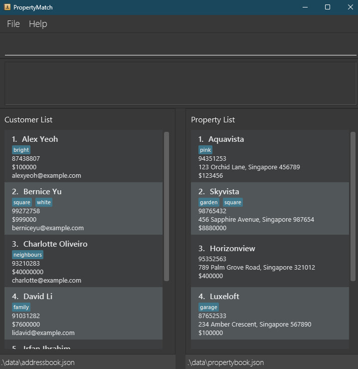
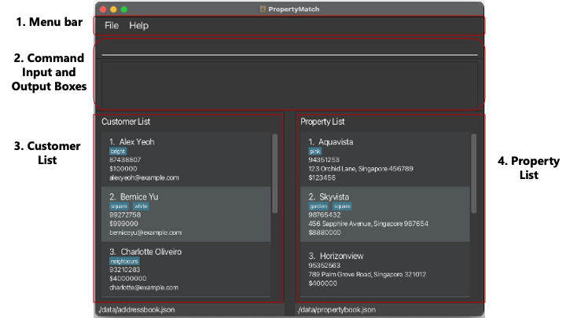
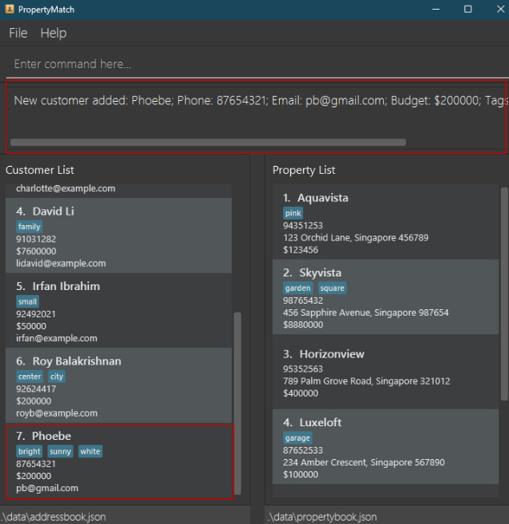
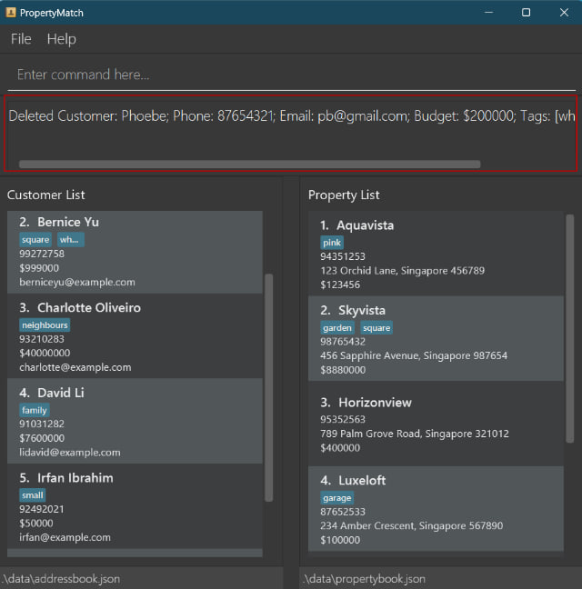
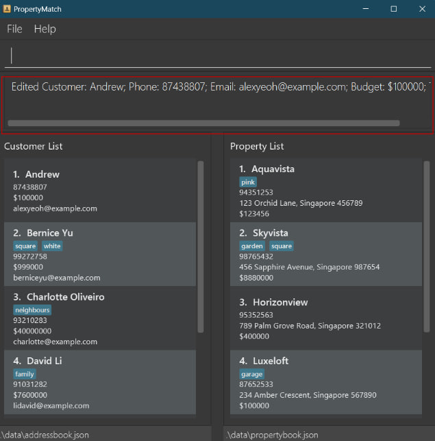
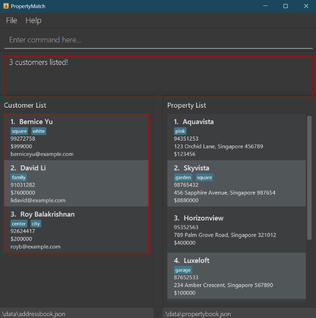
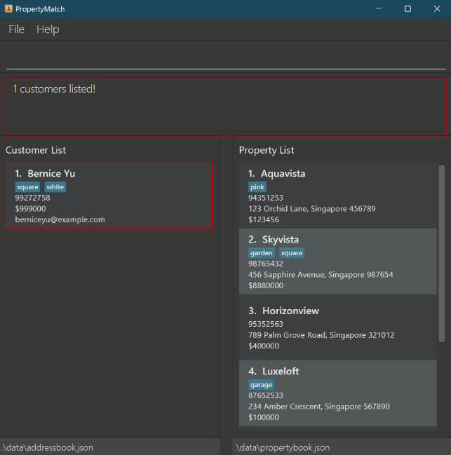
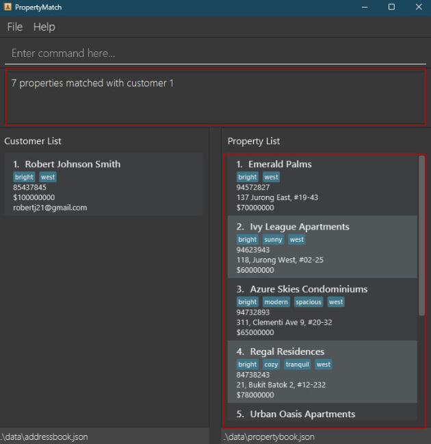

Greetings property agents! A warm welcome to our user guide, your companion for navigating and maximizing the full potential of PropertyMatch.

--------------------------------------------------------------------------------------------------------------------

## Table of Contents

* Table of Contents
{:toc}

--------------------------------------------------------------------------------------------------------------------

## Introduction
[Back to Table of Contents](#table-of-contents)

PropertyMatch is a **contact and property management system** that aims to help you, property agents, to organise their client profiles with their corresponding properties. This guide is designed for property agents ranging from novice tech enthusiasts to seasoned tech professionals who want to organise and streamline their client and property data.

With PropertyMatch, you can easily
- **Match** your existing customers and properties
- **Filter** your existing customers and properties to your needs
- **Find** that customer or property you are looking for, instead of relying on your memory
- and so much more...!

With these powerful features, you can easily capitalise on your network, allowing you to convert them into valuable leads. This can give you the revenue boost you needed to become an all-star property agent.

The only tools you need to make use of the full suite of capabilities PropertyMatch has to offer are your hands and a keyboard.

This **user guide** aims to provide you with an in-depth overview of how to set up, use, and troubleshoot PropertyMatch. Take a leap into the next section to unravel the secrets of maximizing this guide for your benefit!

--------------------------------------------------------------------------------------------------------------------

## Using this Guide
[Back to Table of Contents](#table-of-contents)

As property agents, we understand that using a [Command Line Interface (CLI)](https://en.wikipedia.org/wiki/Command-line_interface) might not be your forte. Fear not! Our application is tailored just for you with simplicity in mind, with easy to use commands that you will naturally reach to without having to remember how to use them.

Already familiar with using a CLI? Great! Feel free to move on to the section below to begin your PropertyMatch journey!

* Embark on your PropertyMatch journey using our [Quick Start](#quick-start) Guide - the express lane to get PropertyMatch up and running in no time!
* Afterwhich, you can head over to our [Interface Layout](#interface-layout) section to familiarise yourself with our snazzy interface and discover the ins and outs of the [CLI](#2-command-input-and-output-boxes). 
* Take a look at the [Command Summary](#command-summary) - your cheatsheet for the different commands along with links to how to use them

Let the fun begin – because who said setting up can't be a joyride?

If you have any doubts while using PropertyMatch, do head over to our FAQ section to view comprehensive answers to some frequently asked questions. You may also contact us at [hello@propertymatch.com](mailto:hello@propertymatch.com) if you have any other questions.

[//]: # (Table inspired by NUSCoursemates https://ay2324s1-cs2103t-t17-4.github.io/tp/UserGuide.html)
In addition, here are some symbols you might encounter in our guide, and their respective meanings.

| Symbol               | Meaning                                                                                        |
|----------------------|------------------------------------------------------------------------------------------------|
| :information_source: | Note. Provides additional information.                                                         |
| :bulb:               | Helpful tip that will improve your experience.                                                 |
| :exclamation:        | Warning. Attempting to perform an action with a warning will lead to undesirable consequences. |

**:information_source: Note:** 
* These symbols will be encapsulated in a box as such.

--------------------------------------------------------------------------------------------------------------------
## Quick start
[Back to Table of Contents](#table-of-contents)

1. Ensure you have Java `11` or above installed in your Computer.
    * [Open up Terminal](#faq) on your computer.
    * Once the Terminal is open, type `java -version` and hit '**Enter/ Return**'.
    * The application should state your Java version as `11`.
    * If you do not see `11`, this [link](https://docs.oracle.com/en/java/javase/11/install/overview-jdk-installation.html#GUID-8677A77F-231A-40F7-98B9-1FD0B48C346A) (external link to Oracle) provides a step-by-step installation guide for Java `11`.

2. Download the latest `propertymatch.jar` from our [releases page](https://github.com/AY2324S1-CS2103T-W11-2/tp/releases). After clicking into the release page, scroll down slightly until you reach the Assets section of the page. This section should look like this: 
 

3. Simply click on `propertymatch.jar`, and PropertyMatch should begin automatically downloading on your computer!

4. Copy the `propertymatch.jar` file to the folder you want to use as the _home folder_ for PropertyMatch. All data will be created and stored in that folder. If you are unsure where to place the folder, go to your desktop and create a folder. You can then copy the `propertymatch.jar` file into the folder you just created.

5. Open the folder and double-click on `propertymatch.jar` to open PropertyMatch. If this does not work, please [open up the terminal](#faq) on your computer and type in `java -jar propertymatch.jar` to start the application.

6. An app similar to the one below should appear in a few seconds. Note that the app already contains some sample data. 
  

Congratulations! PropertyMatch is now set up and ready to work on your system.

If you encounter any problems during the setup process, please check out the FAQ section of this guide, which hopefully contains some information that can help you diagnose your issue.

**:exclamation: Caution (for advanced users):** 
* On first launch, PropertyMatch will create a few files that have the extension `.json` in its *home directory*. These files are used
  by PropertyMatch to store its data.  
* **Edit these at your own risk**, as PropertyMatch will start with an empty [database](#glossary) if it detects any
  error in the formatting of the data in these files.

--------------------------------------------------------------------------------------------------------------------

## Interface Layout
[Back to Table of Contents](#table-of-contents)

When you launch PropertyMatch, PropertyMatch will appear on your screen as a window. Let's take a look at the 5 different components
that make up this window.

### 1. Menu Bar

The Menu Bar is your command center, allowing you to exit the application and look for the link to our user guide.

### 2. Command Input and Output Boxes

These boxes are located at the top section of the window.  
  
The **command input box** is located where the placeholder text `Enter command here...` is. 
Clicking on it will allow you to type commands for PropertyMatch to execute.

The **command output box** is located directly beneath the **command input box**. Upon execution of any command, PropertyMatch will
display some information regarding the command, regardless of whether the command is successfully or not successfully executed.
In the image above, it is displaying the message "Listed all customers", the message shown after successfully executing
the [List Customers Command](#listing-all-customers-listcust).

**:information_source: Note:** 
* If a command is not successfully executed, the text within the command input box will turn red.

Here are some commands you can test to start with. Try it out by copy and pasting in the command input box!

* **`listcust`** : Lists all your recorded customers.

* **`addcust n/Tim Cook p/91234567 e/cook@apple.com b/2500000 c/bright c/sunny`** :
  Adds a customer named "Tim Cook" with a specified phone number and email to the customer list.
  This customer has a specified budget, and desired characteristics for the property he wants to buy.

* **`delcust 1`** : Deletes a customer at index 1 of the [customer list](#2-customer-list)

* **`help`** : Displays a help window.

* **`exit`** : Exits the application.

You can refer to the [Features](#features) below for the details of each command.

### 3. Customer List

You can find the customer list located at the left section of the window.  
  
The customer list displays information regarding customers who are currently stored in PropertyMatch's database.

Note that it might not be showing *all* the customers in the database all the time (check out the [FAQ](#faq) for more information).

You can also filter and modify the customer list using the commands given in the [Features](#features) section below.

### 4. Property List

You can find the property list located at the right section of the window.  
  
The property list displays information regarding properties that are currently stored in PropertyMatch's database.

Note that it might not be showing *all* the properties in the database all the time (check out the [FAQ](#faq) for more information).

You can also filter and modify the property list using the commands given in the [Features](#features) section below.

### 5. Help Window

This will appear as a separate window.

The __help window__ displays a link to PropertyMatch's User Guide, which is the online version of this document.

It appears when you execute the [Help Command](#viewing-help-help).

--------------------------------------------------------------------------------------------------------------------

## Features
[Back to Table of Contents](#table-of-contents)

PropertyMatch's features are mostly in the form of commands you can input into the [command input box](#1-command-input-and-output-boxes). We will now go into the details about each feature of PropertyMatch.
If you just want a quick summary of all the feature PropertyMatch has, do take a look at the [command summary](#command-summary) section.

**:information_source: Notes about the command format:** 

* Words in `UPPER_CASE` are the [parameters](#glossary) to be supplied by the user. 
  e.g. in `add n/NAME`, `NAME` is a parameter which can be used as `add n/John Doe`.

* Items in square brackets are optional. 
  e.g `n/NAME [c/CHARACTERISTIC]` can be used as `n/Tim Cook c/smart` or as `n/John Doe`.

* Items with `…`​ after them can be used multiple times including zero times. 
  e.g. `[c/CHARACTERISTIC]…​` can be used as ` ` (i.e. 0 times), `c/smart`, `c/smart c/rich` etc.

* Parameters can be in any order. 
  e.g. if the command specifies `n/NAME p/PHONE_NUMBER`, `p/PHONE_NUMBER n/NAME` is also acceptable.

* Extraneous parameters for commands that do not take in parameters (such as `help`, `list`, `exit` and `clear`) will be ignored. 
  e.g. if the command specifies `help 123`, it will be interpreted as `help`.

* If you are using a PDF version of this document, be careful when copying and pasting commands that span multiple lines as space characters surrounding line-breaks may be omitted when copied over to the application.

### Add Commands
[Back to Table of Contents](#table-of-contents)

Ready to start adding customer and properties into PropertyMatch? Read the following section to find out more about our add feature.

#### Adding a customer: `addcust`

Adds a customer and their respective contact details and information to your customer list.

Format: `addcust n/NAME p/PHONE e/EMAIL b/BUDGET [c/CHARACTERISTIC]…​`

* `n/NAME`				         : Name of the customer
* `p/PHONE_NUMBER`		         : Phone number of the customer (only 8 digits and starting with 6, 8 or 9)
* `e/EMAIL`				         : Email of the customer
* `b/BUDGET`		             : Budget of the customer (5 to 12 digits and starting with a non-zero digit)
* `c/CHARACTERISTIC` (optional)  : Characteristics of the property the customer is looking for

**:information_source: Note:** 

* `NAME` can be written with alphabets, numbers and spaces but cannot start with a space.
* Duplicate `CHARACTERISTICS` will be omitted, i.e. inputting `c/bright` and `c/BRIGHT` returns 1 `bright` tag.

Examples:
* `addcust n/Tim Cook p/91234567 e/cook@apple.com b/2500000 c/bright c/sunny` adds a customer named Tim Cook with all the relevant details
* `addcust n/Phoebe p/87654321 e/pb@gmail.com b/200000 c/bright c/sunny c/white`adds a customer named Phoebe with all the relevant details

**:bulb: Tip:** 

* If you encounter an error, ensure that you have typed the command accurately with **all** the compulsory [parameters](#glossary) present. (refer to the example commands above) 

* The characteristics are optional. If it is not set, the characteristics field will be empty.

**:information_source: Note:** 

* To ensure that your customer list remains neat, PropertyMatch will warn you when you try to add duplicate customers with the same **phone number**.
* Only the phone number is used to differentiate between customers. i.e. Other parameters can be duplicated for different customers.

You should see the message in the [output box](#2-command-input-and-output-boxes) as below when a customer is successfully added. The new customer will be added to the bottom of your list for easy reference!  
 

#### Adding a property: `addprop`

Adds a property and the respective contact details of the homeowner and information about the property to your property list.

Format: `addprop n/NAME a/ADDRESS p/PHONE_NUMBER pr/PRICE [c/CHARACTERISTIC]…​`

* `n/NAME`				         : Name of the property
* `a/ADDRESS`		             : Address of the property
* `p/PHONE_NUMBER`               : Phone number of the owner of the property  (8 digits and starting with 6, 8 or 9)
* `pr/PRICE`                     : Price of the property (5 to 12 digits and starting with a non-zero digit)
* `c/CHARACTERISTIC` (Optional)  : Characteristics of the property

**:information_source: Note:** 

* `NAME` can be alphanumeric with symbols but cannot start with a space.
* Additional spaces in `ADDRESS` will be considered as unique properties, i.e. `Jden` and `J den` will be considered to be 2 distinct properties.
* Duplicate `CHARACTERISTICS` will be omitted, i.e. inputting `c/bright` and `c/BRIGHT` returns 1 `bright` tag.

Examples:
* `addprop n/Aqua Heights a/195 Paya Lebar 3 #18-32 p/91135235 pr/700000` adds a property with all the relevant details and no characteristics
* `addprop n/Skyview a/214 Clementi Ave 2 #09-78 p/98835235 pr/500000 c/bright c/sunny c/big c/square` adds a property with all the relevant details and 3 characteristics

**:bulb: Tip:** 
* Similar to adding a customer, ensure that you have typed the command accurately with **all** the compulsory [parameters](#glossary) present. (refer to the example commands above) 
* The characteristics are also optional. If it is not set, the characteristics field will be empty.

**:information_source: Note:** 

* To ensure that your property list remains neat, PropertyMatch will warn you when you try to add duplicate properties with the same **address**.
* Only the address is used to differentiate between properties. i.e. Other parameters can be duplicated for different properties.

You should get a result similar to [adding customers](#adding-a-customer--addcust) when the property is successfully added!

### List Commands
[Back to Table of Contents](#table-of-contents)

Want to see all your customers and property details all at one go? Read the following section to find out more about our list feature.

**:bulb: Tip:** 

* The List Commands should be used to view all buyers and properties again, after a [Filter Command](#filter-commands), [Find Command](#find-commands), or [Match Command](#match-commands) is executed.

#### Listing all customers: `listcust`

Updates the [Customer List](#3-customer-list) to show all added customers for ease of viewing.

Format: `listcust`

No additional [parameters](#glossary) are needed for this command, and they will be ignored if used.

#### Listing all properties: `listprop`

Updates the [Property List](#4-property-list) to show all added properties for ease of viewing.

Format: `listprop`

No additional [parameters](#glossary) are needed for this command, and they will be ignored if used.

### Delete Commands
[Back to Table of Contents](#table-of-contents)

Already made a sale and want to remove a customer's or property's details? Read the following section to find out more about our delete feature.

#### Deleting a customer: `delcust`

Deletes the specified customer and their corresponding details from your customer list.

Format: `delcust INDEX`

* Deletes the customer at the specified `INDEX`.
* The index refers to the index number shown in the **displayed** customer list.
* Acceptable indexes are integers within the customer list size.
* The index **must be a positive integer** 1, 2, 3, …​

**:information_source: Note:** 

* `INDEX` can start with 0, i.e. inputting `delcust 02` or `delcust 0002` deletes the second customer in the customer list.

Examples:
* `listcust` followed by `delcust 2` deletes the 2nd customer in the displayed customer list.

Upon successfully deleting a customer, the confirmation message will appear in the [output box](#2-command-input-and-output-boxes) as below!

#### Deleting a property: `delprop`

Deletes the specified property and its corresponding details from your property list.

Format: `delprop INDEX`

* Deletes the property at the specified `INDEX`.
* The index refers to the index number shown in the **displayed** property list.
* Acceptable indexes are integers within the property list size.
* The index **must be a positive integer** 1, 2, 3, …​

**:information_source: Note:** 

* `INDEX` can start with 0, i.e. inputting `delprop 02` or `delprop 0002` deletes the second property in the property list.

Examples:
* `listprop` followed by `delprop 2` deletes the 2nd property in the displayed property list.

The result will be similar to [deleting customers](#deleting-a-customer--delcust) when the property is successfully deleted!

**:exclamation: Caution:** 

Remember to use the `listcust` or `listprop` command after using any commands that require a `INDEX` parameter! If not, the `INDEX` will be with respect to whatever is on the screen at the time of command input.
This applies to [Edit Commands](#edit-commands) and [Match Commands](#match-commands) as well.

### Edit Commands
[Back to Table of Contents](#table-of-contents)

Customer or property details might change after some time and this is where our edit commands can come in handy! Read the following section to find out more about our edit feature.

#### Editing a customer: `editcust`

Edits the details of your customer.

Format: `editcust INDEX [n/NAME] [p/PHONE_NUMBER] [e/EMAIL] [b/BUDGET] [c/CHARACTERISTIC]…​`
* Edits the customer at the specified `INDEX`. 
* The index refers to the index number shown in the **displayed** customer list, it **must be a positive integer** 1, 2, 3, …​
* **At least one** of the optional fields must be provided.
* Existing values will be updated to the input values.

Examples:
*  `editcust 2 p/91234567 e/andrew@gmail.com` Edits the phone number and email of the 2nd customer to be `91234567` and `andrew@gmail.com` respectively.
*  `editcust 1 n/Andrew c/` Edits the name of the 1st customer to be `Andrew` and clears all existing characteristics.

**:information_source: Note:** 

* To ensure that your customer list remains neat, PropertyMatch will warn you when you try to edit your customer to have the same **phone number** as an existing customer.
* Only the phone number is used to differentiate between customers. i.e. Other [parameters](#glossary) can be edited to be the same as other customers.
* Duplicate `CHARACTERISTICS` will be omitted, i.e. inputting `c/bright` and `c/BRIGHT` returns 1 `bright` tag.
* `INDEX` can start with 0, i.e. inputting `editcust 02` or `editcust 0002` edits the second customer in the customer list.

**:bulb: Tip:**  
* When editing characteristics, existing `CHARACTERISTIC` of your customer will be removed i.e. adding of characteristics is not cumulative.
* You can remove all your customer’s `CHARACTERISTIC` by typing `c/` without specifying any `CHARACTERISTIC` after it.

You should see a similar message in the [output box](#2-command-input-and-output-boxes) as below when your customer's details is successfully edited.

When `editcust 1 n/Andrew c/` is entered

#### Editing a property: `editprop`
Edits the details of your property.

Format: `editprop INDEX [n/NAME] [p/PHONE_NUMBER] [pr/PRICE] [a/ADDRESS] [c/CHARACTERISTIC]…​`
* Edits the property at the specified `INDEX`. 
* The index refers to the index number shown in the **displayed** property list. The index **must be a positive integer** 1, 2, 3, …​
* **At least one** of the optional fields must be provided.
* Existing values will be updated to the input values.

Examples:
*  `editprop 1 p/91234567 a/43 Clementi Avenue 3 #03-543` Edits the phone number and address of the 1st property to be `91234567` and `43 Clementi Avenue 3 #03-543` respectively.
*  `editprop 2 n/Skyview c/` Edits the name of the 2nd property to be `Skyview` and clears all existing characteristics.

**:information_source: Note:** 
* To ensure that your property list remains neat, PropertyMatch will warn you when you try to edit your property to have the same **address** as an existing property.
* Only the address is used to differentiate between properties. i.e. Other [parameters](#glossary) can be edited to be the same as other properties.
* `INDEX` can start with 0, i.e. inputting `editprop 02` or `editprop 0002` edits the second property in the property list.
* Additional spaces in `ADDRESS` will be considered as unique properties, i.e. `Jden` and `J den` will be considered to be 2 distinct properties.
* Duplicate `CHARACTERISTICS` will be omitted, i.e. inputting `c/bright` and `c/BRIGHT` returns 1 `bright` tag.

**:bulb: Tip:**  
* When editing characteristics, existing `CHARACTERISTIC` of your property will be removed i.e adding of characteristics is not cumulative.
* You can remove all your property’s `CHARACTERISTIC` by typing `c/` without specifying any `CHARACTERISTIC` after it.

Successfully editing your property would produce a similar result as editing a customer!

### Find Commands
[Back to Table of Contents](#table-of-contents)

Can't seem to find the customer or property you are looking for? Read the follow section to find out more about our `find` feature.

#### Finding a customer: `findcust`

Finds and returns a customer or a list of customers, from all your customers whose name **begins** with `NAME` at **any position** within their name.

Format: `findcust NAME`

* The `NAME` must be in the same language as the name, i.e English.
* The `NAME` should only contain the relevant alphabets.
* The `NAME` should not contain any numbers or symbols.

Examples:
* `list` followed by `findcust F` finds and returns the customers whose names contains any word that starts with `F` in the customer list, such as `Fredy Lawrence` or `Sara Foo`.
* `list` followed by `findcust B D` finds and returns the customers whose names contains any word that starts with `B` and/or `D` in the customer list, such as `Doraemon`, `Boraemon`,`Sara Doo`, `Sara Boo`, or `Bara Doo`.

You should see the message in the [output box](#2-command-input-and-output-boxes) as below when you have successfully found your customers.

When `findcust B D` is entered.

#### Finding a property: `findprop`

Finds and returns a property or a list of properties, from all your properties whose name **begins** with `NAME` at **any position** within its name.

Format: `findprop NAME`

* The `NAME` must be in the same language as the name, i.e English.
* The `NAME` should only contain the relevant alphabets.
* The `NAME` should not contain any numbers or symbols.

Examples:
* `list` followed by `findprop F` finds and returns the properties with names that begin with "F" in the property list, such as `Fernvale Square` or `Dairy Farm`.
* `list` followed by `findprop F J` finds and returns the properties with names that begin with "F" or "J" in the property list, such as `Fernvale Square`, `Dairy Farm`, `Jden` or `Changi Jail`.

Successfully finding the property you want would produce a similar result as [finding a customer](#finding-a-customer--findcust)!

### Filter Commands
[Back to Table of Contents](#table-of-contents)

Want to only see selected customers or properties? Read the following section to find out more about our filter feature.

#### Filter customers: `filtercust`

Filters all your customers to only show customers that fit the criteria.

Format: `filtercust [b/BUDGET] [c/CHARACTERISTIC]…​`

* Filter and return the customers whose budget is greater than or equals to `BUDGET` and have **all** the `CHARACTERISTIC`.
* `b/BUDGET` (optional)          : Budget of the customer
* `c/CHARACTERISTIC` (optional)  : Characteristics of the property the customer is looking for

**:information_source: Note:** 
* While both `BUDGET` and `CHARACTERISTIC` are optional, at least one of them should be present.

**:bulb: Tip:**  
* Omitting`BUDGET` will return customers in search of properties with the specified `CHARACTERISTIC`. 
* Omitting `CHARACTERISTIC` will return customers with a budget greater than or equal to `BUDGET`.

Examples:
* `filtercust b/250000 c/white c/big`
* `filtercust c/white`

You should see the message in the [output box](#2-command-input-and-output-boxes) as below when you have successfully filtered your customers.

When `filtercust c/white` is entered.

#### Filter properties: `filterprop`

Filters all your properties to only show properties that fit the criteria.

Format: `filterprop [pr/PRICE] [c/CHARACTERISTIC]…​`

* Filter and return properties priced lower than or equals to `PRICE` and have **all** the `CHARACTERISTIC`.
* `pr/PRICE` (optional)          : The price of the property
* `c/CHARACTERISTIC` (optional)  : The characteristics of the property

**:information_source: Note:** 
* While both `PRICE` and `CHARACTERISTIC` are optional, at least one of them should be present.

**:bulb: Tip:** 
* Omitting `PRICE` will return the properties which have all the `CHARACTERISTIC`. 
* Omitting `CHARACTERISTIC` will return properties priced lower than or equal to `PRICE`.

Examples:
* `filterprop pr/250000 c/white c/big`
* `filterprop c/white`

Successfully filtering your properties would produce a similar result as [filtering your customers](#filter-customers--filtercust)!

### Match Commands
[Back to Table of Contents](#table-of-contents)

Ready to match customers and properties? Our unique matching feature has the power to match customers and properties easily! Read the following section to find out more about our match feature.

#### Matching properties to a customer: `matchcust`

Shows the list of properties that matches the criteria of your customer.

Format: `matchcust INDEX`

* Matches the customer at the specified `INDEX`.
* The index refers to the index number shown in the **displayed** customer list.
* Acceptable indexes are integers within the customer list size.
* The index **must be a positive integer** 1, 2, 3, …​

#### How does `matchcust` work?

For `matchcust`, a property will be matched to the specified customer, if and only if:  
* The price of property is less than or equal to budget of the customer,
* At least 1 matching tag (If the customer has existing tags),
* If the customer has no tag, only the budget requirement needs to be met.

**:information_source: Note:** 

* `INDEX` can start with 0, i.e. inputting `matchcust 02` or `matchcust 0002` matches the second customer in the customer list to potential properties.

Examples:
* `matchcust 1`
* `matchcust 10`

A message in the [output box](#2-command-input-and-output-boxes) similar to the one below should appear when you have successfully matched your customers!

#### Matching customers to a property: `matchprop`

Shows the list of customers that matches the criteria of your property.

Format: `matchprop INDEX`

* Matches the property at the specified `INDEX`.
* The index refers to the index number shown in the **displayed** property list.
* Acceptable indexes are integers within the property list size.
* The index **must be a positive integer** 1, 2, 3, …​

#### How does `matchprop` work?

For `matchprop`, a customer will be matched to the specified property, if and only if:  
* The budget of customer is greater than or equal to the price of the property,
* At least 1 matching tag (If the property has existing tags),
* If the property has no tag, only the price requirement needs to be met.

**:information_source: Note:** 

* `INDEX` can start with 0, i.e. inputting `matchprop 02` or `matchprop 0002` matches the second property in the property list to potential customers.

Examples:
* `matchprop 1`
* `matchprop 10`

Matching your properties successfully will output a similar message as [matching your customers](#matching-properties-to-a-customer--matchcust).

### General Features

[Back to Table of Contents](#table-of-contents)

Want to start fresh and clear all your existing data? Exit the application? Or in need of assistance? Read the follow section to find out more about our clear, exit and help feature.

#### Clear the data in the application: `clear`

Resets all data in the application. (i.e. Deletes all entries in your Customer List and Property List)

Format: `clear`

 

**:exclamation: Caution:** 
* Clearing the data in your application will result in all data being lost! Be careful when you perform this operation and be sure that you want to reset all data in the app.

#### Exiting the program: `exit`

Displays a goodbye message. Exit the application after 3 seconds.

Format: `exit`

#### Viewing help: `help`

Displays a window containing the link to PropertyMatch's user guide if you need further help.

Format: `help`

#### Saving data

PropertyMatch data is saved in the hard disk automatically after any command that changes the data. There is no need to save manually.

#### Editing the data file

PropertyMatch's data is saved as 2 separate JSON files `[JAR file location]/data/addressbook.json` and `[JAR file location]/data/propertybook.json`. Advanced users are welcome to update data directly by editing those JSON files.

**:exclamation: Caution (for advanced users):** 
* If your changes to the data file makes its format invalid, PropertyMatch will discard all data and start with an empty data file at the next run. Hence, it is recommended to make a backup of the file before editing it.

 

--------------------------------------------------------------------------------------------------------------------

## FAQ
[Back to Table of Contents](#table-of-contents)

**Q**: How do I transfer my data to another Computer? 
**A**: Install the app in the other computer and overwrite the empty data file it creates with the file that contains the data of your previous PropertyMatch home folder.

**Q**: How do I install Java 11? 
**A**: Follow this [link](https://docs.oracle.com/en/java/javase/11/install/overview-jdk-installation.html#GUID-8677A77F-231A-40F7-98B9-1FD0B48C346A) for steps to download Java 11.

**Q**: Help! I can’t seem to get a command to work… 
**A**: Refer to the [features](#features) section of our guide for command information and syntax. Make sure that you have supplied all necessary inputs for the command and specified the flags in a correct manner.

**Q**: Why is PropertyMatch not displaying all customers/properties in the [database](#glossary)? 
**A**:  It's possible that the application may not show all customers/properties all the time due to specific commands like [filtering](#filter-commands), [finding](#finding-commands), or [matching](#match-commands) that have been executed. If you're encountering this issue, consider using the [list commands](#list-commands) to ensure you're viewing the complete list.

**Q**: I don’t understand some terms used in the guide… 
**A**: Please check out the [glossary](#glossary) and see if the term that you are confused about is documented there!

**Q**: I deleted my data file! Is there any way to recover the data that I lost? 
**A**: Try looking in your computer’s trash bin on macOS or recycle bin on Windows for the files that were deleted. If the files can’t be found, then we apologise, but there is currently no way for you to retrieve lost data. 🙁

**Q**: How do I uninstall PropertyMatch? 
**A**: We are sad to see you go 🙁 PropertyMatch is not installed onto your [hard drive](#glossary), so you only need to delete the folder that contains propertymatch.jar (that is, the home folder of PropertyMatch).

**Q**: Do I need an active internet connection to use PropertyMatch? 
**A**: No, PropertyMatch is a standalone application that does not require an internet connection to function. However, you'll need an internet connection to download it to your machine.

**Q**: I can't find what i need... 
**A**: The guide is divided into sections for easy navigation. Use the [table of contents](#table-of-contents) to locate what you are looking for.

**Q**: How do I open Terminal? 
**A**:The method for opening up the Terminal will be different for every operating system: 
* If you are using Windows, press the '**Windows**' key and search for'**Terminal**'. 
* If you are using a Mac, click on '**F4**' and search for '**Terminal**'.  
* If you are using a Linux system, press '**Ctrl**' + '**Alt**' + '**T**' keys simultaneously.

--------------------------------------------------------------------------------------------------------------------

## Known issues
[Back to Table of Contents](#table-of-contents)

1. **When using multiple screens**, if you move the application to a secondary screen, and later switch to using only the primary screen, the app will open off-screen. The remedy is to delete the `preferences.json` file created by the application before running the application again.

--------------------------------------------------------------------------------------------------------------------

## Command summary
[Back to Table of Contents](#table-of-contents)

| Action                                                                           | Format, Examples                                                                                                                                                |
|----------------------------------------------------------------------------------|-----------------------------------------------------------------------------------------------------------------------------------------------------------------|
| **[Add customer](#adding-a-customer-addcust)**                                   | `addcust n/NAME p/PHONE_NUMBER e/EMAIL b/BUDGET [c/CHARACTERISTIC]…​`   e.g., `addcust n/Phoebe p/87654321 e/pb@gmail.com b/200000 c/bright c/sunny c/white` |
| **[Add property](#adding-a-property-addprop)**                                   | `addprop n/NAME a/ADDRESS p/PHONE_NUMBER pr/PRICE [c/CHARACTERISTIC]…​`   e.g., `addprop n/Aqua Heights a/195 Paya Lebar 3 #18-32 p/91135235 pr/700000`      |
| **[List properties](#listing-all-customers-listcust)**                           | `listcust`                                                                                                                                                      |
| **[List customers](#listing-all-properties-listprop)**                           | `listprop`                                                                                                                                                      |
| **[Delete customer](#deleting-a-customer-delcust)**                              | `delcust INDEX`  e.g., `delcust 3`                                                                                                                           |
| **[Delete property](#deleting-a-property-delprop)**                              | `delprop INDEX`  e.g., `delprop 3`                                                                                                                           |
| **[Edit customer](#editing-a-customer-editcust)**                                | `editcust INDEX [n/NAME] [p/PHONE_NUMBER] [e/EMAIL] [b/BUDGET] [c/CHARACTERISTIC]…​`   e.g., `editcust 1 p/91234567 e/andrew@gmail.com`                      |
| **[Edit property](#editing-a-property-editprop)**                                | `editprop INDEX [n/NAME] [a/ADDRESS] [p/PHONE_NUMBER] [pr/PRICE] [c/CHARACTERISTIC]…​`   e.g., `editprop 1 ph/91234567 a/43 Clementi Avenue 3 #03-543`       |
| **[Find customers](#finding-a-customer-findcust)**                               | `findcust NAME`   e.g., `findcust Amy`                                                                                                                       |
| **[Find properties](#finding-a-property-findprop)**                              | `findprop NAME`   e.g., `findprop Skyview`                                                                                                                   |
| **[Filter customers](#filter-customers-filtercust)**                             | `filtercust [b/BUDGET] [c/CHARACTERISTIC]…​`   e.g., `filtercust b/250000 c/white`                                                                           |
| **[Filter properties](#filter-properties-filterprop)**                           | `filterprop [pr/PRICE] [c/CHARACTERISTIC]…​`   e.g., `filterprop pr/250000 c/white`                                                                          |
| **[Match properties to customer](#matching-properties-to-a-customer-matchcust)** | `matchcust INDEX`   e.g., `matchcust 1`                                                                                                                      |
| **[Match customers to property](#matching-customers-to-a-property-matchprop)**   | `matchprop INDEX`   e.g., `matchprop 1`                                                                                                                      |
| **[Clear](#clear-the-data-in-the-application-clear)**                            | `clear`                                                                                                                                                         |
| **[Exit](#exiting-the-program-exit)**                                            | `exit`                                                                                                                                                          |
| **[Help](#viewing-help-help)**                                                   | `help`                                                                                                                                                          |

--------------------------------------------------------------------------------------------------------------------

## Glossary
[Back to Table of Contents](#table-of-contents)

| Term                         | Description                                                                                                                                                                                                                                                                                                                |
|------------------------------|----------------------------------------------------------------------------------------------------------------------------------------------------------------------------------------------------------------------------------------------------------------------------------------------------------------------------|
| Command Line Interface (CLI) | A text-based way to interact with a computer or software by typing commands into a command prompt. Instead of using buttons and icons, you enter commands to perform tasks.                                                                                                                                                |
| Parameter                    | Think of parameters like customizing your command. If you're telling someone to bake a cake, the flavor, size, and frosting type are your parameters. In PropertyMatch commands, parameters are the details you provide to make the command do exactly what you need. They're like the specific settings for your command. |
| Database                     | A database is like a digital filing cabinet where we store and organize information for easy access and management. It's a structured collection of data, simplifying how we keep things in order.                                                                                                                         |
| Hard Disk                    | An internal or external computer component that stores data, such as the operating system, applications, and user files.                                                                                                                                                                                                   |
