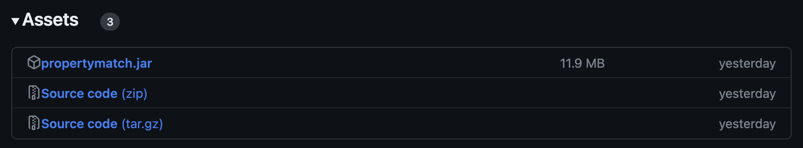
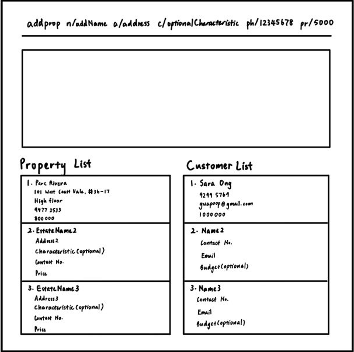
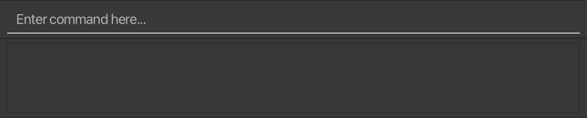
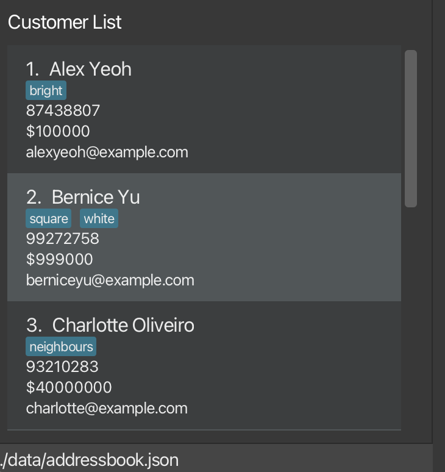
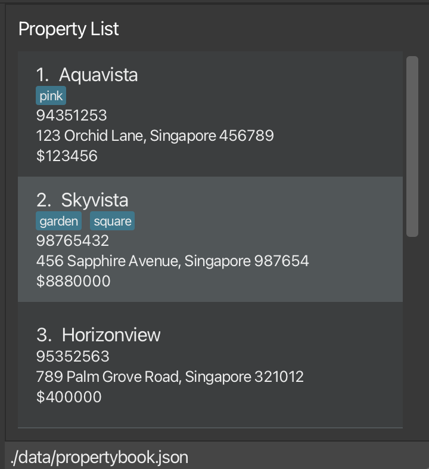

PropertyMatch is a **contact and property management system** that aims to help property agents who want to organise their client profiles with their corresponding properties.

As property agents, you can make use of PropertyMatch’s powerful match and filter features to capitalise on your existing contacts and properties, allowing you to convert them into your valuable leads. This can give you the revenue boost you needed to become an all-star property agent. Leverage on PropertyMatch’s find feature to quickly locate customers that you want to retrieve information about.

The only tools you need to make use of the full suite of capabilities PropertyMatch has to offer are your hands and a keyboard.

This **user guide** aims to provide you with an in-depth overview of how to set up, use, and debug PropertyMatch. Take a look at the Command Summary section for a quick overview of the different commands along with how to use them, or dive into the Quick Start section to get started.

* Table of Contents
  {:toc}

--------------------------------------------------------------------------------------------------------------------

## Quick start
[Back to top](#table-of-contents)

1. Ensure you have Java `11` or above installed in your Computer. If needed, this [link](https://docs.oracle.com/en/java/javase/11/install/overview-jdk-installation.html#GUID-8677A77F-231A-40F7-98B9-1FD0B48C346A) (external link to Oracle) provides a step-by-step installation guide for Java `11`.

1. Download the latest `propertymatch.jar` from our [releases page](https://github.com/AY2324S1-CS2103T-W11-2/tp/releases). After clicking into the release page, scroll down slightly until you reach the Assets section of the page. This section should look like this: 
   

1. Simply click on `propertymatch.jar`, and PropertyMatch should begin automatically downloading on your computer!

1. Copy the `propertymatch.jar` file to the folder you want to use as the _home folder_ for PropertyMatch. All data will be created and stored in that folder. If you are unsure where to place the folder, go to your desktop and create a folder. You can then copy the `propertymatch.jar` file into the folder you just created.

1. Open the folder and double click on `propertymatch.jar` to open PropertyMatch. If this does not work, please open up the terminal on your computer and type in `java -jar propertymatch.jar` to start the application.
   A GUI similar to the below should appear in a few seconds. Note how the app contains some sample data. 
   

Congratulations! PropertyMatch is now set up and ready to work on your system.

If you encounter any bugs during the setup process, please check out the FAQ section of this guide, which hopefully contains some information that can help you diagnose your issue.

:exclamation: **Caution (for advanced users):**
On first launch, PropertyMatch will create a few files that have the extension `.json` in its *home directory*. These files are used
by PropertyMatch to store its data. **Edit these at your own risk**, as PropertyMatch will start with an empty database if it detects any
error in the formatting of the data in these files.

 

--------------------------------------------------------------------------------------------------------------------

## Interface Layout
[Back to top](#table-of-contents)

When you launch PropertyMatch, PropertyMatch will appear on your screen as a window. Let's take a look at the 4 different components
that make up this window.

### 1. Command Input and Output Boxes
These boxes are located at the top section of the window.  
  
The **command input box** is located where the placeholder text `Enter command here...` is. 
Clicking on it will allow you to type commands for PropertyMatch to execute.

The **command output box** is located directly beneath the **command input box**. Upon execution of any command, PropertyMatch will
display some information regarding the command, regardless of whether the command is successfully or not successfully executed.
In the image above, it is displaying the message "Listed all customers", the message shown after successfully executing
the [List Customers Command](#listing-all-customers-listcust).

:exclamation: **Note:**
If a command is not successfully executed, the text within the command input box will turn red.

Here are some commands you can test to start with.

* **`listcust`** : Lists all customers in the database.

* **`addcust n/ Tim Cook p/91234567 e/cook@apple.com b/2500000 c/bright c/sunny`** :
  Adds a customer named "Tim Cook" with a specified phone number and email to the database.
  This customer has a specified budget, and desired characteristics for the property he wants to buy.

* **`delcust 1`** : Deletes a customer at index 1 of the [customer list](#2-customer-list) from the database.

* **`help`** : Displays a help window.

* **`exit`** : Exits the application.

You can refer to the [Features](#features) below for the details of each command.

### 2. Customer List
You can find the customer list located at the left section of the window.  
  
The customer list displays information regarding customers who are currently stored in PropertyMatch's database.

Note that it might not be showing *all* the customers in the database all the time (check out the [FAQ](#faq) for more information).

You can also filter and modify the customer list using the commands given in the [Features](#features) section below.

### 3. Property List
You can find the property list located at the right section of the window.  
  
The property list displays information regarding properties that are currently stored in PropertyMatch's database.

Note that it might not be showing *all* the properties in the database all the time (check out the [FAQ](#faq) for more information).

You can also filter and modify the property list using the commands given in the [Features](#features) section below.

### 4. Help Window
This will appear as a separate window.

The __help window__ displays a link to PropertyMatch's User Guide, which is the online version of this document. :)

It appears when you execute the [Help Command](#viewing-help-help).

--------------------------------------------------------------------------------------------------------------------

## Features
[Back to top](#table-of-contents)

PropertyMatch's features are mostly in the form of commands you can input into the [command input box](#1-command-input-and-output-boxes). We will now go into the details about each feature of PropertyMatch.
If you just want a quick summary of all the feature PropertyMatch has, do take a look at the [command summary](#command-summary) section.

**:information_source: Notes about the command format:** 

* Words in `UPPER_CASE` are the parameters to be supplied by the user. 
  e.g. in `add n/NAME`, `NAME` is a parameter which can be used as `add n/John Doe`.

* Items in square brackets are optional. 
  e.g `n/NAME [t/TAG]` can be used as `n/John Doe t/friend` or as `n/John Doe`.

* Items with `…`​ after them can be used multiple times including zero times. 
  e.g. `[t/TAG]…​` can be used as ` ` (i.e. 0 times), `t/friend`, `t/friend t/family` etc.

* Parameters can be in any order. 
  e.g. if the command specifies `n/NAME p/PHONE_NUMBER`, `p/PHONE_NUMBER n/NAME` is also acceptable.

* Extraneous parameters for commands that do not take in parameters (such as `help`, `list`, `exit` and `clear`) will be ignored. 
  e.g. if the command specifies `help 123`, it will be interpreted as `help`.

* If you are using a PDF version of this document, be careful when copying and pasting commands that span multiple lines as space characters surrounding line-breaks may be omitted when copied over to the application.

### Adding a customer: `addcust`

Adds a customer to the application.

Format: `addcust n/NAME p/PHONE e/EMAIL b/BUDGET [c/CHARACTERISTIC]…​`

Parameter:
* `n/NAME`				         : The name of the customer (String)
* `p/PHONE`		                 : The phone number of the customer (String)
* `e/EMAIL`				         : The email of the customer (String)
* `b/BUDGET`		             : The budget of the customer (Integer)
* `c/CHARACTERISTIC` (optional)  : The characteristics of the property the customer is looking for (String)

Examples:
* `addcust n/Fredy p/12345678 e/fredylawrence@gmail.com b/1000000`
* `addcust n/Boedi p/88888888 e/boedi@gmail.com b/250000 c/white`
* `addcust n/Phoebe p/87654321 e/pb@gmail.com b/200000`

When command succeeds:
* `New customer added:Name; Phone:PHONE; Email:EMAIL; Budget:BUDGET; Tags:[TAGS]…​`

When command fails:
* `Missing name parameter for add customers command` for missing name parameter
* `Missing phone parameter for add customers command` for missing phone parameter
* `Missing email parameter for add customers command` for missing email parameter
* `Invalid Command` for misspelling of command

### Adding a property: `addprop`

Adds a property to the application.

Format: `addprop n/NAME a/ADDRESS [c/CHARACTERISTIC] ph/number pr/budget`

Parameter:
* `n/NAME`				         : The Name of the property (String)
* `a/ADDRESS`		             : The Address of the property (String)
* `c/CHARACTERISTIC` (Optional)  : The characteristics of the property (String)
* `ph/NUMBER`                    : The contact number (Integer)
* `pr/PRICE`                     : The price of the property in psf (Number)

Examples:
* addprop n/Fredy a/randomAddress c/bright;sunny;big;square ph/91135235 pr/5
* addprop n/Fredy a/randomAddress ph/91135235 pr/5

When command succeeds:
* `New property added:Name; Address:ADDRESS; Phone:PHONE; Price:price; Tags:[TAGS]…​`

When command fails:
* `This property already exist` if the property have the same Name and Address
* `Missing Name parameter for add properties command` for missing Name parameter
* `Missing Address parameter for add properties command` for missing Address parameter
* `Missing number parameter for add properties command` for missing Name parameter
* `Missing price parameter for add properties command` for missing price parameter
* `Invalid Command` for mispelling of command

### Listing all customers : `listcust`

Updates the Customer List to show all customers in your database.

Format: `listcust`

No additional parameters are needed for this command and they will be ignored if used.

When command succeeds: Customer list will be updated to show all properties in your database.

### Listing all properties : `listprop`

Updates the Property List to show all properties in your database.

Format: `listprop`

No additional parameters are needed for this command and they will be ignored.

When command succeeds: Property list will be updated to show all properties in your database.

When command fails: Invalid command for misspelling of command

### Deleting a customer : `delcust`

Deletes the specified customer and their corresponding details from the database.

Format: `delcust INDEX`

* Deletes the customer at the specified `INDEX`.
* The index refers to the index number shown in the displayed customer list.
* The index **must be a positive integer** 1, 2, 3, …​

Examples:
* `list` followed by `delcust 2` deletes the 2nd customer in the customer list.

When command succeeds:
* `deleted customer 3`

When command fails:
* `Missing customer index` for missing parameter
* `No such customer index` for wrong parameter/ index beyond list size
* `Invalid command` for misspelling of command

### Deleting a property : `delprop`

Format: `delprop INDEX`

* Deletes the property at the specified `INDEX`.
* The index refers to the index number shown in the displayed property list.
* Acceptable parameters are integers within the property list size.
* The index **must be a positive integer** 1, 2, 3, …​

Examples:
* `delprop 2` deletes the 2nd property in the address book.

When command succeeds: `deleted property 2`

When command fails:
* `Missing property index` for missing parameter
* `No such property index` for wrong parameter or index beyond list size
* `Invalid command` for misspelling of command

### Editing a customer : `editcust`
Edits an existing customer.
Format: `editcust INDEX [n/NAME] [ph/PHONE] [e/EMAIL] [b/BUDGET] [c/CHARACTERISTIC]…​`
* Edits the customer at the specified `INDEX`. The index refers to the index number shown in the displayed customer list. The index **must be a positive integer** 1, 2, 3, …​
* At least one of the optional fields must be provided.
* Existing values will be updated to the input values.
* When editing tags, the existing tags of the property will be removed i.e adding of tags is not cumulative.
* You can remove all the person’s tags by typing `c/` without
  specifying any tags after it.
  Examples:
*  `editcust 1 ph/91234567 e/andrew@gmail.com` Edits the phone number and email of the 1st customer to be `91234567` and `andrew@gmail.com` respectively.
*  `editcust 2 n/Andrew c/` Edits the name of the 2nd customer to be `Andrew` and clears all existing tags.

### Editing a property : `editprop`
Edits an existing property.
Format: `editprop INDEX [n/NAME] [ph/PHONE] [pr/PRICE] [a/ADDRESS] [c/CHARACTERISTIC]…​`
* Edits the property at the specified `INDEX`. The index refers to the index number shown in the displayed property list. The index **must be a positive integer** 1, 2, 3, …​
* At least one of the optional fields must be provided.
* Existing values will be updated to the input values.
* When editing tags, the existing tags of the property will be removed i.e adding of tags is not cumulative.
* You can remove all the person’s tags by typing `c/` without
  specifying any tags after it.
  Examples:
*  `editprop 1 ph/91234567 a/43 Clementi Avenue 3 #03-543` Edits the phone number and address of the 1st property to be `91234567` and `43 Clementi Avenue 3 #03-543` respectively.
*  `editprop 2 n/Skyview t/` Edits the name of the 2nd property to be `Skyview` and clears all existing tags.
* 
### Finding a customer : `findcust`

Finds and returns a customer or a list of customers whose name contains the substring inputted.

Format: `findcust NAME`

* Finds and returns the customer(s) whose name contains the `NAME` substring.
* The `NAME` must be in the same language as the name, i.e English.
* The `NAME` should only contain the relevant alphabets

Examples:
* `list` followed by `findcust F` finds and returns the customer(s) with names that begin with "F" in the customer list.
* `list` followed by `findcust F J` finds and returns the customer(s) with names that begin with "F" and/or "J" in the customer list.

When command succeeds:
* `1 customer listed`

When command fails:
* `Invalid command format` for missing parameter
* `Unknown command` for misspelling of command

### Finding a property : `findprop`

Finds and returns a property or a list of properties whose name contains the substring inputted.

Format: `findprop NAME`

* Finds and returns the property or properties whose name contains the `NAME` substring.
* The `NAME` must be in the same language as the name, i.e English.
* The `NAME` should only contain the relevant alphabets

Examples:
* `list` followed by `findprop F` finds and returns the property or properties with names that begin with "F" in the property list.
* `list` followed by `findprop F J` finds and returns the property or properties with names that begin with "F" and/or "J" in the property list.

When command succeeds:
* `1 property listed`

When command fails:
* `Invalid command format` for missing parameter
* `Unknown command` for misspelling of command

### Filter customers : `filtercust`

Format: `filtercust [b/BUDGET] [c/CHARACTERISTIC]…​`

Parameter:
* `b/BUDGET` (optional)          : The budget of the customer (Integer)
* `c/CHARACTERISTIC` (optional)  : The characteristics of the property the customer is looking for (String)

Notes:
* Even though both `BUDGET` and `CHARACTERISTIC` are optional, at least one of them should exist.

Examples:
* `filtercust b/100000`
* `filtercust b/250000 c/white`
* `filtercust c/white`

When command succeeds:
* `4 customers listed!` when there are 4 customers fulfilling the filter.

When command fails:
* `Invalid command format!` for missing both `BUDGET` and `CHARACTERISTIC` parameters.
* `Unknown command` for misspelling of command.

### Filter properties : `filterprop`

Format: `filtercust [pr/PRICE] [c/CHARACTERISTIC]…​`

Parameter:
* `pr/PRICE` (optional)          : The budget of the property (Integer)
* `c/CHARACTERISTIC` (optional)  : The characteristics of the property (String)

Note:
* Even though both `PROPERTY` and `CHARACTERISTIC` are optional, at least one of them should exist.

Examples:
* `filterprop pr/100000`
* `filterprop pr/250000 c/white`
* `filterprop c/white`

When command succeeds:
* `4 properties listed!` when there are 4 properties fulfilling the filter.

When command fails:
* `Invalid command format!` for missing both `PRICE` and `CHARACTERISTIC` parameters.
* `Unknown command` for misspelling of command.

### Matching properties to customer : `matchcust`

Format: `matchcust [INDEX]`

Parameter:
* `INDEX`         : The index number of the customer you want to match.

Notes:
* The Index must in the range of customers you have added.

Examples:
* `matchcust 1`
* `matchcust 10`
* `matchcust 32`

When command succeeds:
* `4 properties matched with customer 1!` when there are 4 properties fulfilling the criteria of the customer 1.

When command fails:
* `Invalid command format!` for missing `INDEX` parameters.
* `Unknown command` for misspelling of command.
* `There is no customer with index [INDEX]` for `INDEX` inputted is not in the range of the customers. 

### Matching customers to property : `matchprop`

Format: `matchprop [INDEX]`

Parameter:
* `INDEX`         : The index number of the property you want to match.

Notes:
* The Index must in the range of properties you have added.

Examples:
* `matchprop 1`
* `matchprop 10`
* `matchprop 32`

When command succeeds:
* `4 customers matched with property 1!` when there are 4 customers have the criteria of the property 1.

When command fails:
* `Invalid command format!` for missing `INDEX` parameters.
* `Unknown command` for misspelling of command.
* `There is no proeprty with index [INDEX]` for `INDEX` inputted is not in the range of the properties.

### Clear the data in the application : `clear`

Resets all data in the application.

Format: `clear`

:exclamation: **Warning:**
Clearing the data in your application will result in all data being lost! Be careful when you perform this operation and be sure that you want to reset all data in the app.

 

When command succeeds: All data in the application will be cleared.

When command fails: Invalid command for misspelling of command

### Exiting the program : `exit`

Displays a goodbye message. Exit the application after 3 seconds.

Format: `exit`

When command succeeds: Exit from application

When command fails: Invalid command for misspelling of command
--------------------------------------------------------------------------------------------------------------------

## FAQ

**Q**: How do I transfer my data to another Computer? 
**A**: Install the app in the other computer and overwrite the empty data file it creates with the file that contains the data of your previous PropertyMatch home folder.

**Q**: How do I install Java 11? 
**A**: Follow this [link](https://www3.ntu.edu.sg/home/ehchua/programming/howto/jdk_howto.html) for steps to download Java.

**Q**: Help! I can’t seem to get a command to work… 
**A**: Refer to the features section of our guide for command information and syntax. Make sure that you have supplied all necessary inputs for the command and specified the flags in a correct manner.

**Q**: I don’t understand some terms used in the guide… 
**A**: Please check out the key definitions portion of the guide and see if the term that you are confused about is documented there!

**Q**: I deleted my data file! Is there any way to recover the data that I lost? 
**A**: Try looking in your computer’s trash bin on macOS or recycle bin on Windows for the files that were deleted. If the files can’t be found, then we apologise, but there is currently no way for you to retrieve lost data. 🙁

**Q**: How do I uninstall PropertyMatch? 
**A**: We are sad to see you go 🙁 PropertyMatch is not installed onto your hard drive, so you only need to delete the folder that contains propertymatch.jar (that is, the home folder of PropertyMatch).

--------------------------------------------------------------------------------------------------------------------

## Known issues

1. **When using multiple screens**, if you move the application to a secondary screen, and later switch to using only the primary screen, the GUI will open off-screen. The remedy is to delete the `preferences.json` file created by the application before running the application again.

--------------------------------------------------------------------------------------------------------------------

## Command summary

| Action                           | Format, Examples                                                                                                                                                       |
|----------------------------------|------------------------------------------------------------------------------------------------------------------------------------------------------------------------|
| **Add customer**                 | `addcust n/NAME p/PHONE e/EMAIL [b/BUDGET] [c/CHARACTERISTIC]`   e.g., `addcust n/Fredy p/12345678 e/fredylawrence@gmail.com b/100000`                              |
| **Add property**                 | `addprop n/NAME a/ADDRESS [c/CHARACTERISTIC] ph/number pr/budget`   e.g., `addprop n/Property a/randomAddress c/bright c/sunny c/big c/square p/91135235 pr/500000` |
| **Delete customer**              | `delcust INDEX`  e.g., `delcust 3`                                                                                                                                  |
| **Delete property**              | `delprop INDEX`  e.g., `delprop 3`                                                                                                                                  |
| **Edit customer**                | `editcust INDEX n/NAME p/PHONE e/EMAIL [b/BUDGET] [c/CHARACTERISTIC]`   e.g., `editcust 1 ph/91234567 e/andrew@gmail.com`                                           |
| **Edit property**                | `editprop INDEX n/NAME a/ADDRESS [c/CHARACTERISTIC] ph/number pr/budget`   e.g., `editprop 1 ph/91234567 a/43 Clementi Avenue 3 #03-543`                            |
| **List properties**              | `listprop`                                                                                                                                                             |
| **List customers**               | `listcust`                                                                                                                                                             |
| **Find customers**               | `findcust NAME`                                                                                                                                                        |
| **Find properties**              | `findprop NAME`                                                                                                                                                        |
| **Filter properties**            | `filterprop [pr/PRICE] [c/CHARACTERISTIC]`   e.g., `filterprop pr/250000 c/white`                                                                                   |
| **Filter customers**             | `filtercust [b/BUDGET] [c/CHARACTERISTIC]`   e.g., `filtercust b/250000 c/white`                                                                                    |
| **Match properties to customer** | `matchcust INDEX`   e.g., `matchcust 1`                                                                                                                             |
| **Match customers to property**  | `matchprop INDEX`   e.g., `matchprop 1`                                                                                                                             |
| **Clear**                        | `clear`                                                                                                                                                                |
| **Exit**                         | `exit`                                                                                                                                                                 |
| **Help**                         | `help`                                                                                                                                                                 |
